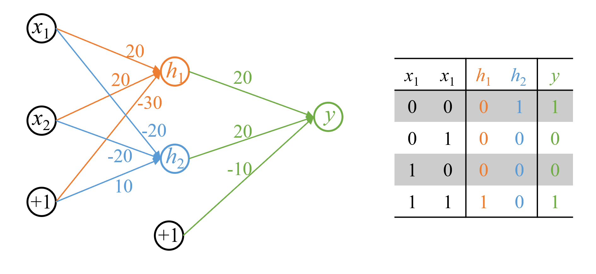
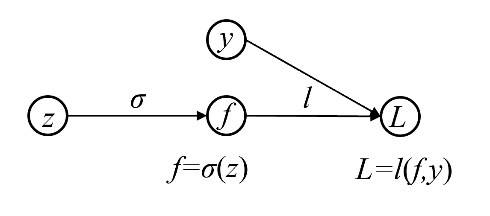
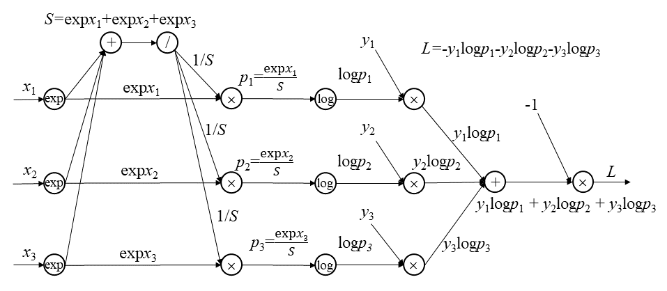
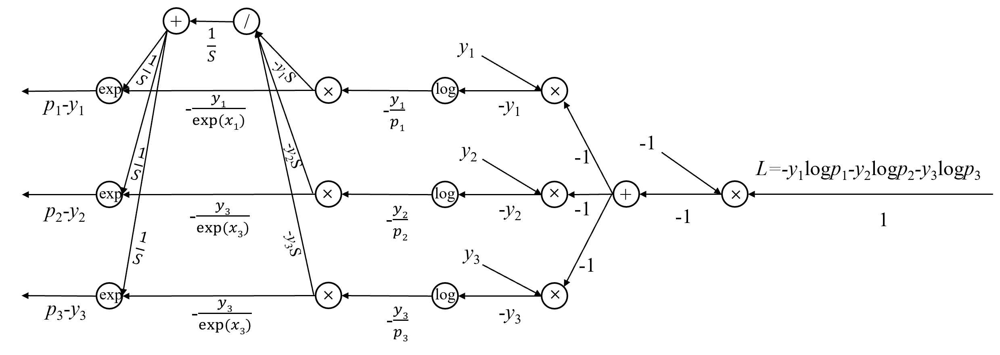

# 第23章前馈神经网络

## 习题23.1

&emsp;&emsp;构造前馈神经网络实现逻辑表达式XNOR，使用S型函数为激活函数。

**解答：**  

**解答思路：**

1. 给出同或函数(XNOR)的输入和输出
2. 用神经网络实现的门表示XNOR
3. 设计神经网络实现XNOR
4. 自编程实现二层前馈神经网络表示XNOR

**解答步骤：**  

**第1步: 给出同或函数(XNOR)的输入和输出**

&emsp;&emsp;对于同或函数(XNOR)，全部的输入与对应的输出如下：

|<div style="width:20px">$x_1$</div>|<div style="width:20px">$x_2$</div>|<div style="width:92px">$y=x_1 \odot x_2$</div>|
|:-: | :-: | :-: |  
| 0 | 0 | 1 | 
| 0 | 1 | 0 | 
| 1 | 0 | 0 | 
| 1 | 1 | 1 | 

**第2步: 用神经网络实现的门表示XNOR**

&emsp;&emsp;XNOR（同或门）和XOR（异或门）由于都是线性不可分的，不能由一层神经网络实现，但它们可由一层神经网络实现的门组合实现。

&emsp;&emsp;一层神经网络可实现的门包括AND（与门，用$x_1 \wedge x_2$表示）、NOR（或非门，用$\overline{x_1 \vee x_2}$表示）、OR（或门，用$x_1 \vee x_2$表示）等。

&emsp;&emsp;同或函数可表示：
$$
x_1 \odot x_2 = (x_1 \wedge x_2) \vee \overline{x_1 \vee x_2}
$$

**第3步: 设计神经网络实现XNOR**

&emsp;&emsp;根据书中第23.1.1节的S型函数的定义：
> S型函数（sigmoid function）又称为逻辑斯谛函数（logistic function），是定义式如下的非线性函数：
$$
a(z) = \sigma(z) = \frac{1}{ 1 + e^{-z}} \tag{23.14}
$$
其中，$z$是自变量或输入，$\sigma(z)$是因变量或输出。函数的定义域为$(-\infty, \infty)$，值域为$(0, 1)$。

&emsp;&emsp;可知：
$$
\text{sigmoid}(10) \approx 1 \\
\text{sigmoid}(-10) \approx 0
$$

&emsp;&emsp;可设计如下二层前馈神经网络表示XNOR：
$$
h_1 = x_1 \wedge x_2 \\
h_2 = \overline{x_1 \vee x_2} \\
y = h_1 \vee h_2
$$



&emsp;&emsp;根据书中第23.1.1节的二层前馈神经网络的矩阵表示：

> 二层前馈神经网络也可以用矩阵来表示，简称矩阵表示：
$$
\boldsymbol{h}^{(1)} = f^{(1)}(\boldsymbol{x}) = a(z^{(1)}) = a({\boldsymbol{W}^{(1)}}^T \boldsymbol{x} + \boldsymbol{b}^{(1)}) \\
\boldsymbol{y} = f^{(2)}(\boldsymbol{h}^{(1)}) = g(z^{(2)}) = g({\boldsymbol{W}^{(2)}}^T \boldsymbol{h} + \boldsymbol{b}^{(2)}) 
$$

&emsp;&emsp;其中，
$$
\boldsymbol{x} = 
\left [
\begin{array}{c}
x_1 \\
x_2
\end{array}
\right ] \\
\boldsymbol{h} = 
\left [
\begin{array}{c}
h_1 \\
h_2
\end{array}
\right ] \\
\boldsymbol{W^{(1)}} = 
\left [
\begin{array}{cc}
20 & -20\\
20 & -20
\end{array}
\right ] \\
\boldsymbol{W^{(2)}} = 
\left [
\begin{array}{c}
20 \\
20 
\end{array}
\right ] \\
\boldsymbol{b^{(1)}} = 
\left [
\begin{array}{c}
-30 \\
10 
\end{array}
\right ] \\
\boldsymbol{b^{(2)}} = [-10]
$$

**第4步: 自编程实现二层前馈神经网络表示XNOR**


```python
import numpy as np

# 定义网络的权重W和偏置b
W1 = np.array([[20, -20], [20, -20]])
b1 = np.array([[-30], [10]])
W2 = np.array([[20], [20]])
b2 = np.array([[-10]])

def sigmoid(x):
    s = 1 / (1 + np.exp(-x))
    return s

def dnn_xnor(X):
    Z1 = W1.T.dot(X) + b1
    H = sigmoid(Z1)

    Z2 = W2.T.dot(H) + b2
    Y = sigmoid(Z2)
    
    return Y 
```


```python
X = np.array([[0, 0, 1, 1],
              [0, 1, 0, 1]])

with np.printoptions(suppress=True):
    result = dnn_xnor(X)
    print(result)
```

    [[0.99995456 0.00004548 0.00004548 0.99995456]]
    

## 习题23.2
&emsp;&emsp;写出多标签分类学习中的损失函数以及损失函数对输出变量的导数。

**解答：**

**解答思路：**  

1. 给出前馈神经网络学习在多标签分类时的模型
2. 写出多标签分类学习中的损失函数
3. 求损失函数对输出变量的导数

**解答步骤：**   

**第1步: 前馈神经网络学习在多标签分类时的模型**

&emsp;&emsp;根据书中第23.1.1节的前馈神经网络学习在多标签分类时的模型：

> &emsp;&emsp;用于多标签分类（multi-label classification）。神经网络的输出层有 $l$ 个神经元，每个神经元的输出是一个概率值。神经网络表示为 $\boldsymbol{p} = [P(y_k = 1 | \boldsymbol{x})] = f(\boldsymbol{x})$，其中$y_k \in \{0 , 1\}, k = 1, 2, \cdots, l$，满足条件
> 
> $$
0 < P(y_k = 1 | \boldsymbol{x}) < 1, \ P(y_k = 1 | \boldsymbol{x}) + P(y_k = 0 | \boldsymbol{x}) = 1, \ k = 1, 2, \cdots, l
$$
> 
> $[P(y_1 = 1 | \boldsymbol{x}), P(y_2 = 1 | \boldsymbol{x}), \cdots, P(y_l = 1 | \boldsymbol{x})]$ 表示输入 $\boldsymbol{x}$ 分别属于1个类别的概率。预测时给定输入 $\boldsymbol{x}$，计算其属于各个类别的概率。将输入分到概率大于0.5的所有类别，这时输入可以被分到多个类别（赋予多个标签）。

**第2步: 写出多标签分类学习中的损失函数**

&emsp;&emsp;多标签分类时，输出层有$l$个神经元，每个神经元输出是一个概率值，表示属于各标签的概率。多标签分类学习中的损失函数通常为二元交叉熵（Binary Cross-Entropy, BCE）损失函数：
$$
\text{BCELoss}=-\frac{1}{N}\sum_{i=1}^N\sum_{k=1}^l [y_{ik} \log(p_{ik}) + (1 - y_{ik}) \log (1 - p_{ik})]
$$
其中，$N$是样本的数量，$l$是标签的数量，$y_{ik}$是第$i$个样本的第$k$个标签的真实值，$p_{ik}$是第$i$样本属于第$k$个标签的预测概率。

**第3步: 求损失函数对输出变量的导数**

&emsp;&emsp;输出层的输出变量是经过S型激活函数变换后的值，即$p_{ik}$，则BCELoss对$p_{ik}$求导：
$$
\begin{aligned}
\frac{\partial \text{BCELoss}}{\partial p_{ik}} 
& = -\frac{1}{N} \left( \frac{y_{ik}}{p_{ik}} - \frac{1 - y_{ik}}{1 - p_{ik}} \right) \\
& = -\frac{1}{N} \left( \frac{y_{ik} - y_{ik} p_{ik} - p_{ik} + y_{ik} p_{ik}}{p_{ik}(1 - p_{ik})} \right) \\
& = \frac{p_{ik} - y_{ik} }{N p_{ik}(1 - p_{ik})}
\end{aligned}
$$

即：
$$
\frac{\partial \text{BCELoss}}{\partial p_{ik}} = \frac{p_{ik} - y_{ik} }{N p_{ik}(1 - p_{ik})}
$$

## 习题23.3
&emsp;&emsp;实现前馈神经网络的反向传播算法，使用MNIST数据构建手写数字识别网络。

**解答：**

**解答思路：**  

1. 给出MNIST手写数字识别网络
2. 给出前馈神经网络的反向传播算法
3. 自编程实现使用MNIST数据集构建手写数字识别网络

**解答步骤：**   

**第1步: MNIST手写数据识别网络**

&emsp;&emsp;根据书中第23章例23.4给出MNIST手写数字识别网络：

> &emsp;&emsp;MNIST是一个机器学习标准数据集。每一个样本由一个像素为28 $\times$ 28 的手写数字灰度图像以及的0\~9之间的标签组成，像素取值为0\~255。  
> &emsp;&emsp;可以构建图23.14所示的前馈神经网络对MNIST的手写数字进行识别，是一个多标签分类模型。输入层是一个$28 \times 28 = 784$维向量，取自一个图像，每一维对应一个像素。第一层和第二层是隐层，各自有100个神经元和50个神经元，其激活函数都是S型函数。第三层是输出层，有10个神经元，其激活函数也是S型函数。给定一个图像，神经网络可以计算出其属于0\~9类的概率，将图像赋予概率最大的标签。 

**第2步：前馈神经网络的反向传播算法**

&emsp;&emsp;根据书中第23.2.3节的算法23.3的前馈神经网络的反向传播算法：
> **算法23.3 （前馈神经网络的反向传播算法）**    
输入：神经网络$f(\boldsymbol{x};\boldsymbol{\theta})$，参数向量$\boldsymbol{\theta}$，一个样本$(\boldsymbol{x}, \boldsymbol{y})$  
输出：更新的参数向量$\boldsymbol{\theta}$  
超参数：学习率$\eta$  
> 1. 正向传播，得到各层输出$\boldsymbol{h}^{(1)}, \boldsymbol{h}^{(2)}, \cdots, \boldsymbol{h}^{(s)}$  
> $$
\boldsymbol{h}^{(0)} = \boldsymbol{x}
$$
> For $t = 1,2, \cdots, s$，do {
> $$
z^{(t)} = \boldsymbol{W}^{(t)} \boldsymbol{h}^{(t - 1)} + \boldsymbol{b}^{(t)} \\
\boldsymbol{h}^{(t)} = a (z^{(t)})
$$
> } 
> 2. 反向传播，得到各层误差$\boldsymbol{\delta}^{(s)},\cdots, \boldsymbol{\delta}^{(2)}, \boldsymbol{\delta}^{(1)}$，同时计算各层的梯度，更新各层的参数。  
> 计算输出层的误差
> $$
\boldsymbol{\delta}^{(s)} = \boldsymbol{h}^{(s)} - \boldsymbol{y}
$$
> For $t = s, \cdots, 2, 1$，do {  
> &emsp;&emsp;计算第$t$层的梯度
> $$
\nabla_{\boldsymbol{W}^{(t)}} L = \boldsymbol{\delta}^{(t)} \cdot {\boldsymbol{h}^{(t - 1)}}^T \\
\nabla_{\boldsymbol{b}^{(t)}} L = \boldsymbol{\delta}^{(t)}
$$
>  &emsp;&emsp;根据梯度下降公式更新第$t$层的参数  
> $$
\boldsymbol{W}^{(t)} \leftarrow \boldsymbol{W}^{(t)} - \eta \nabla_{\boldsymbol{W}^{(t)}} L \\
\boldsymbol{b}^{(t)} \leftarrow \boldsymbol{b}^{(t)} - \eta \nabla_{\boldsymbol{b}^{(t)}} L
$$
>  &emsp;&emsp; If ($t > 1$) {  
>  &emsp;&emsp; &emsp;&emsp;将第$t$层的误差传到第$t - 1$层
> $$
\boldsymbol{\delta}^{(t - 1)} = \frac{\partial a}{\partial z^{(t - 1)}} \odot \left ( {\boldsymbol{W}^{(t)}}^T \cdot \boldsymbol{\delta}^{(t)} \right )
$$  
>  &emsp;&emsp;}  
> }
> 3. 返回更新的参数向量

**第3步：自编程实现使用MNIST数据集构建手写数字识别网络**


```python
import numpy as np
from sklearn.datasets import fetch_openml
from sklearn.model_selection import train_test_split
from sklearn.preprocessing import LabelBinarizer

from tqdm import tqdm

np.random.seed(2023)
```


```python
class NeuralNetwork:
    def __init__(self, layers, alpha=0.1):
        # 网络层的神经元个数，其中第一层和第二层是隐层
        self.layers = layers
        # 学习率
        self.alpha = alpha
        # 权重
        self.weights = []
        # 偏置
        self.biases = []
        # 初始化权重和偏置
        for i in range(1, len(layers)):
            self.weights.append(np.random.randn(layers[i-1], layers[i]))
            self.biases.append(np.random.randn(layers[i]))

    def sigmoid(self, x):
        return 1 / (1 + np.exp(-x))

    def sigmoid_derivative(self, x):
        return x * (1 - x)
    
    def feedforward(self, inputs):
        '''
        （1）正向传播
        '''
        self.activations = [inputs]
        self.weighted_inputs = []
        for i in range(len(self.weights)):
            weighted_input = np.dot(self.activations[-1], self.weights[i]) + self.biases[i]
            self.weighted_inputs.append(weighted_input)
            # 得到各层的输出h
            activation = self.sigmoid(weighted_input)
            self.activations.append(activation)
   
        return self.activations[-1]

    def backpropagate(self, expected):
        '''
        （2）反向传播
        '''
        # 计算各层的误差
        errors = [expected - self.activations[-1]]
        # 计算各层的梯度
        deltas = [errors[-1] * self.sigmoid_derivative(self.activations[-1])]
        
        for i in range(len(self.weights)-1, 0, -1):
            error = deltas[-1].dot(self.weights[i].T)
            errors.append(error)
            delta = errors[-1] * self.sigmoid_derivative(self.activations[i])
            deltas.append(delta)
        deltas.reverse()
        
        for i in range(len(self.weights)):
            # 更新参数
            self.weights[i] += self.alpha * np.array([self.activations[i]]).T.dot(np.array([deltas[i]]))
            self.biases[i] += self.alpha * np.sum(deltas[i], axis=0)

    def train(self, inputs, expected_outputs, epochs):
        for i in tqdm(range(epochs)):
            for j in range(len(inputs)):
                self.feedforward(inputs[j])
                self.backpropagate(expected_outputs[j])
```


```python
# 加载MNIST手写数字数据集
mnist = fetch_openml('mnist_784', parser='auto')
X = mnist.data.astype('float32') / 255.0
y = mnist.target.astype('int')
```


```python
# 划分训练集和测试集
lb = LabelBinarizer()
y = lb.fit_transform(y)
X = np.array(X)

X_train, X_test, y_train, y_test = train_test_split(X, y, test_size=0.2, random_state=42)
```


```python
# 训练神经网络，其中第一层和第二层各有100个神经元和50个神经元
nn = NeuralNetwork([784, 100, 50, 10], alpha=0.1)
nn.train(X_train, y_train, epochs=10)
```

    100%|███████████████████████████████████████████████████████████████████████████████████████████████████████████████████████████████████████████████| 10/10 [02:21<00:00, 14.20s/it]
    


```python
# 使用测试集对模型进行评估
correct = 0

for i in range(len(X_test)):
    output = nn.feedforward(X_test[i])
    prediction = np.argmax(output)
    actual = np.argmax(y_test[i])
    if prediction == actual:
        correct += 1

accuracy = correct / len(X_test) * 100
print("Accuracy: {:.2f} %".format(accuracy))
```

    Accuracy: 93.94 %
    

## 习题23.4

&emsp;&emsp;写出S型函数的正向传播和反向传播的计算图。

**解答：**

**解答思路：**  

1. 写出S型函数的正向传播计算图
2. 写出S型函数的反向传播计算图

**解答步骤：**   

**第1步: 写出S型函数的正向传播计算图**

&emsp;&emsp;根据书中第23.2.4节给出了S型函数的计算图例：

> &emsp;&emsp;起点$z$, $y$是输入变量，终点$L$是输出变量，中间结点$f$是中间变量。变量$f$由S型函数$f = \sigma(z)$决定，变量$L$由损失函数$L = l(f,y)$决定。

&emsp;&emsp;根据书中第23.2.4节给出的计算图的正向传播：

> &emsp;&emsp;在计算图上进行的正向传播就是计算复合函数 $L=l(\sigma(z), y)$ 的过程。从起点 $z, y$ 开始，顺着有向边，在结点 $f, L$ 依次进行计算，先后得到函数$f, L$；其中先对 $z$ 计算 $f(z)$ 得到 $f$，然后对 $f$ 和 $y$ 计算 $l(f, y)$ 得到 $L$。



**第2步: 写出S型函数的反向传播计算图**

&emsp;&emsp;根据书中第23.2.4节给出的计算图的方向传播：

> &emsp;&emsp;反向传播就是计算复合函数$L = l(\sigma (z), y)$ 对变量的梯度的过程。从终止起点 $L$ 出发，逆着有向边，在结点 $y, f, z$ 依次进行，向后得到梯度$\displaystyle \frac{\text{d} L}{\text{d} y}, \frac{\text{d} L}{\text{d} f}, \frac{\text{d} L}{\text{d} z}$；其中先根据定义计算$\displaystyle \frac{\text{d} L}{\text{d} y}, \frac{\text{d} L}{\text{d} f}$，再利用链式规则计算$\displaystyle \frac{\text{d} L}{\text{d} z}$：
> 
> $$
\frac{\text{d} L}{\text{d} z} = \frac{\text{d} L}{\text{d} f} \cdot \frac{\text{d} L}{\text{d} f} \cdot f (1 - f)
$$
> 梯度$\displaystyle \frac{\text{d} L}{\text{d} f}$在结点 $f$ 的反向传播变为梯度的$f (1 - f)$ 倍，传到输入结点 $z$。


## 习题23.5

&emsp;&emsp;图23.31是3类分类的正向传播计算图，试写出它的反向传播计算图。这里使用软最大化函数和交叉熵损失。



**解答：**

**解答思路：**  

1. 根据正向传播计算图，根据链式法则，逐步求导给出各层的梯度
2. 绘制反向传播的计算图

**解答步骤：**   

**第1步：根据正向传播计算图，根据链式法则，逐步求导给出各层的梯度**

&emsp;&emsp;见下图中各层的梯度计算结果。

**第2步：绘制反向传播的计算图**



## 习题23.6
&emsp;&emsp;写出批量归一化的反向传播算法。

**解答：**

**解答思路：**  

1. 给出批量归一化算法
2. 求批量归一化层的梯度
3. 写出全连接层的梯度
4. 写出批量归一化的反向传播算法

**解答步骤：**   

**第1步：批量归一化算法**

&emsp;&emsp;根据书中第23.2.5节的算法23.4的批量归一化算法：

> **算法23.4（批量归一化）**      
> 输入：神经网络结构$f(\boldsymbol{x};\boldsymbol{\theta})$，训练集，测试样本。  
> 输出：对测试样本的预测值。  
> 超参数：批量容量的大小 $n$。  
> {  
> &emsp;&emsp;初始化参数$\boldsymbol{\theta}, \phi$，其中$\phi = \{ \gamma^{(t)}, \beta^{(t)}\}_{t = 1}^{s - 1}$  
&emsp;&emsp;For each (批量$b$) {  
> &emsp;&emsp;&emsp;&emsp;For $t = 1, 2, \cdots, s - 1 $ {  
> &emsp;&emsp;&emsp;&emsp;&emsp;&emsp;针对批量$b$计算第$t$层净输入的均值$\boldsymbol{u}^{(t)}$和方差$\boldsymbol{{\sigma^2}^{(t)}}$  
> &emsp;&emsp;&emsp;&emsp;&emsp;&emsp;进行第$t$层的批量归一化，得到批量净输入  
> $$
z_j^{(t)} \rightarrow \bar{z}_j^{(t)} \rightarrow \tilde{z}_j^{(t)}, \quad j = 1, 2, \cdots, n
$$
> &emsp;&emsp;&emsp;&emsp;}   
> &emsp;&emsp;}  
> &emsp;&emsp;构建训练神经网络$f_{\text{Tr}}(\boldsymbol{x}; \boldsymbol{\theta}, \phi)$  
> &emsp;&emsp;使用随机梯度下降法训练$f_{\text{Tr}}(\boldsymbol{x}; \boldsymbol{\theta}, \phi)$，估计所有参数$\boldsymbol{\theta}, \phi$  
> &emsp;&emsp;For $t = 1, 2, \cdots, s - 1$ {  
> &emsp;&emsp;&emsp;&emsp;针对所有批量计算$t$层净输入的期待的均值$E_b(\boldsymbol{u}^{(t)})$和方差$E_b({\boldsymbol{\sigma}^2}^{(t)})$  
> &emsp;&emsp;&emsp;&emsp;针对测试样本，进行第$t$层的批量归一化，得到净输入
> $$
z_j^{(t)} \rightarrow \bar{z}_j^{(t)} \rightarrow \tilde{z}_j^{(t)}, \quad j = 1, 2, \cdots, n
$$
> &emsp;&emsp;}  
> &emsp;&emsp;构建推理神经网络$f_{\text{Inf}}(\boldsymbol{x}; \boldsymbol{\theta}, \phi)$  
> &emsp;&emsp;输出$f_{\text{Inf}}(\boldsymbol{x}; \boldsymbol{\theta}, \phi)$对测试样本的预测值  
> }

**第2步：求批量归一化层的梯度**

&emsp;&emsp;根据书中第404页图23.25（批量归一化层的正向计算图），求每一步的反向梯度。

&emsp;&emsp;假设损失函数为$L$，已知$L$对$\tilde{z}_j$的偏导$\displaystyle \frac{\partial L}{\partial {\tilde{z}_j}}$，求$\displaystyle \frac{\partial L}{\partial \gamma}, \frac{\partial L}{\partial \beta}, \frac{\partial L}{\partial {\bar{z}_j}}$，可得：

$$
\begin{aligned}
\frac{\partial L}{\partial \gamma} &= \sum_{j=1}^N \frac{\partial L}{\partial {\tilde{z}_j}} \bar{z}_j \\
\frac{\partial L}{\partial \beta} &= \sum_{i=1}^N \frac{\partial L}{\partial {\tilde{z}_j}} \\
\frac{\partial L}{\partial \bar{z}_j} &= \frac{\partial L}{\partial {\tilde{z}_j}} \gamma \\
\end{aligned}
$$

&emsp;&emsp;根据书中第403页的公式23.61：
$$
\bar{z}_j = \frac{z_j - u}{ \sqrt{\sigma^2 + \epsilon}}, \quad j = 1, 2, \cdots, n \tag{23.61}
$$
可将$\displaystyle \frac{\partial L}{\partial {z_j}}$分成$\bar{z}_j, \mu, \sigma^2$三部分进行求解，可得：

$$
\frac{\partial L}{\partial {z_j}} = \frac{\partial L}{\partial \bar{z}_j} \frac{1}{\sqrt{\sigma^2 + \epsilon}} + \frac{\partial L}{\partial \mu} \cdot \frac{\partial \mu}{\partial z_j} + \frac{\partial L}{\partial \sigma^2} \cdot \frac{\partial \sigma^2}{\partial z_j}
$$

&emsp;&emsp;根据书中第403页的公式23.59, 23.60：
$$
u = \frac{1}{n} \sum_{j = 1}^n z_j \tag{23.59}
$$
$$
\sigma^2 = \frac{1}{n - 1} \sum_{j = 1}^n (z_j - u)^2 \tag{23.60}
$$
可分别求$\displaystyle \frac{\partial L}{\partial \mu}, \frac{\partial \mu}{\partial z_j}, \frac{\partial L}{\partial \sigma^2}, \frac{\partial \sigma^2}{\partial z_j}$，可得：

$$
\begin{aligned}
\frac{\partial L}{\partial \mu} &= \sum_{j=1}^n \frac{\partial L}{\partial \bar{z}_j} \cdot \frac{-1}{\sqrt{\sigma^2 + \epsilon}} + \frac{\partial L}{\partial \sigma^2} \frac{\displaystyle - \sum_{j=1}^n 2(z_j - \mu)}{n} \\
\frac{\partial \mu}{\partial z_j} &= \frac{1}{n} \\
\frac{\partial L}{\partial \sigma^2} &= \sum_{j=1}^n \frac{\partial L}{\partial \bar{z}_j} \cdot {(z_j - \mu)} \cdot \frac{-(\sigma^2 + \epsilon)^{-3/2}}{2} \\
\frac{\partial \sigma^2}{\partial z_j} &= \frac{2(z_j - \mu)}{n} \\
\frac{\partial L}{\partial z_j} &= \frac{\partial L}{\partial \bar{z}_j} \frac{1}{\sqrt{\sigma^2 + \epsilon}} + \frac{\partial L}{\partial \mu} \cdot \frac{1}{n} + \frac{\partial L}{\partial \sigma^2} \cdot \frac{2(z_j - \mu)}{n}
\end{aligned}
$$

**第3步：结合批量归一化层的梯度，写出全连接层的梯度**

第$t$层的误差为：

$$
\delta_j^{(t)} = \frac{\partial L}{\partial z_j^{(t)}}
$$

参数$W$的梯度为：

$$
\begin{aligned}
\frac{\partial L}{\partial W^{(t)}} 
&= \sum_{j=1}^n \frac{\partial L}{\partial z_j^{(t)}} \frac{\partial z_j^{(t)}}{\partial W^{(t)}} \\
&= \sum_{j=1}^n \delta_j^{(t)} \cdot h_j^{(t-1)}
\end{aligned}
$$

参数$b$的梯度为：

$$
\begin{aligned}
\frac{\partial L}{\partial b^{(t)}} 
&= \sum_{j=1}^n \frac{\partial L}{\partial z_j^{(t)}} \frac{\partial z_j^{(t)}}{\partial b^{(t)}} \\
&= \sum_{j=1}^n \delta_j^{(t)}
\end{aligned}
$$

$t+1$层和$t$层之间的关系为：
$$
\delta_j^{(t)} = \frac{\partial{a}}{\partial{\tilde{z}_j^{(t)}}} \cdot \frac{\partial \tilde{z}_j^{(t)}}{\partial z_j^{(t)}} \cdot W^{(t+1)} \cdot \delta_j^{(t+1)}
$$
其中，$a$表示激活函数。

**第4步：写出批量归一化的反向传播算法**

> 输入：神经网络结构$f(\boldsymbol{x};\boldsymbol{\theta}, \phi)$，训练集$(\boldsymbol{x}, \boldsymbol{y})$  
输出：参数向量$\boldsymbol{\theta}, \phi$  
超参数：学习率$\eta$，批量容量的大小$n$  
> 
> 算法步骤：
> 1. 初始化参数$\boldsymbol{\theta}, \phi$，其中$\phi=\{\gamma^{(t)}, \beta^{(t)}\}_{t=1}^{s-1}$
> 2. 计算输出层误差
$$
\delta^{(s)} = h^{(s)} -y
$$
> 3. For each(批量 $b$) {  
> &emsp;&emsp;For $t = s, \cdots ,2,1$， do {    
> &emsp;&emsp;&emsp;&emsp;计算第$t$层的梯度 $\nabla_{W^{(t)}}L, \nabla_{b^{(t)}}L, \nabla_{\gamma^{(t)}}L, \nabla_{\beta^{(t)}}L$  
> &emsp;&emsp;&emsp;&emsp;更新第$t$层的参数
> $$
W^{(t)} \leftarrow W^{(t)}-\eta\nabla_{W^{(t)}}L \\
b^{(t)} \leftarrow b^{(t)}-\eta\nabla_{b^{(t)}}L \\
\gamma^{(t)} \leftarrow \gamma^{(t)}-\eta\nabla_{\gamma^{(t)}}L \\
\beta^{(t)} \leftarrow \beta^{(t)}-\eta\nabla_{\beta^{(t)}}L
$$
> &emsp;&emsp;&emsp;&emsp;If ($t>1$) {  
> &emsp;&emsp;&emsp;&emsp;&emsp;&emsp;将第$t$层的参数误差传递到第$t-1$层  
> $$
\delta_j^{(t-1)} = \frac{\partial{a}}{\partial{\tilde{z}_j^{(t - 1)}}} \cdot \frac{\partial \tilde{z}_j^{(t - 1)}}{\partial z_j^{(t - 1)}} \cdot W^{(t)} \cdot \delta_j^{(t)}
$$
> &emsp;&emsp;&emsp;&emsp;}  
> &emsp;&emsp;}  
> }  
> 4. 返回更新的参数向量

## 习题23.7
&emsp;&emsp;验证逆暂退法和暂退法的等价性。

**解答：**

**解答思路：**  

1. 写出暂退法（dropout）计算公式
2. 写出逆暂退法（inverted dropout）计算公式
3. 证明两者等价

**解答步骤：**   

**第1步: 写出暂退法（dropout）计算公式**

&emsp;&emsp;根据书中第23.3.3节的暂退法的描述：

> &emsp;&emsp;假设某一隐层的输出向量是 $\boldsymbol{h}$，误差向量是 $\boldsymbol{\delta}$，该层神经元保留与退出的结果用随机向量 $\boldsymbol{d}$ 表示，其中 $\boldsymbol{d} \in \{0, 1\}^m$ 是维度为 $m$ 的 $0-1$ 向量，1表示对应的神经元保留，0表示对应的神经元退出。那么，在反向传播算法的每一步，经过保留与退出随机判断后，该层的向量表示变为
> $$
\tilde{\boldsymbol{h}} = \boldsymbol{d} \odot \boldsymbol{h} \tag{23.69}
$$
> $$
\tilde{\boldsymbol{\delta}} = \boldsymbol{d} \odot \boldsymbol{\delta} \tag{23.70}
$$
> 这里 $\odot$ 表示逐元素积，使用 $\tilde{\boldsymbol{h}}$ 进行正向传播和使用 $\tilde{\boldsymbol{\delta}}$ 进行反向传播。注意暂退法中每一步的 $\boldsymbol{d}$ 是随机决定的，各步之间并不相同。  
> &emsp;&emsp;预测时，对隐层的输出向量进行调整：
> $$
\tilde{\boldsymbol{h}}=p \cdot \boldsymbol{h} \tag{23.71}
$$
> 其中，$p$ 是这层的保留概率。

&emsp;&emsp;由上述可知，暂退法训练时的计算公式：

$$
\tilde{\boldsymbol{h}} = \boldsymbol{d} \odot \boldsymbol{h}
$$

预测时的计算公式：

$$
\tilde{\boldsymbol{h}}=p \cdot \boldsymbol{h}
$$

**第2步: 写出逆暂退法（inverted dropout）计算公式**

&emsp;&emsp;根据书中第23.3.3节的逆暂退法的描述：

> &emsp;&emsp;为了方便暂退法的实现，常常采用以下等价的逆暂退法。训练时，将隐层的输出变量放大$\displaystyle \frac{1}{p}$ 倍：
> $$
\tilde{\boldsymbol{h}}= \frac{1}{p} \cdot \boldsymbol{d} \odot \boldsymbol{h} \tag{23.72}
$$
> 预测时，隐层的输出权重保持不变。

&emsp;&emsp;由上述可知，逆暂退法训练时计算公式：

$$
\tilde{\boldsymbol{h}}= \frac{1}{p} \cdot \boldsymbol{d} \odot \boldsymbol{h}
$$

预测时，隐层的输出权重保持不变，可得：
$$
\tilde{\boldsymbol{h}}= \boldsymbol{h}
$$

**第3步: 证明两者等价**

&emsp;&emsp;假设不考虑神经元的保留或丢弃时，隐层的输出为

$$
y = a(W^{T}x+b)
$$

其中$a$为激活函数，$W$为权重参数，$b$为偏置参数。

&emsp;&emsp;假设某一隐层，使用暂退法训练得到的隐层输出向量为$\boldsymbol{h}_{\text{drop}}$，逆暂退法训练得到的隐层输出向量为$\boldsymbol{h}_{\text{inv}}$。

&emsp;&emsp;根据暂退法训练时的计算公式，暂退法训练时的输出期望为
$$
E[\tilde{\boldsymbol{h}}_{\text{drop}}] = E[\boldsymbol{d} \odot \boldsymbol{h}_{\text{drop}}]
$$

其中 $d$ 表示该层神经元保留与退出的结果，$d$ 为1的概率为 $p$，$p$ 即保留概率，为0的概率为 $1-p$。$d$ 符合伯努利分布，所以：

$$
\begin{aligned}
E[\tilde{\boldsymbol{h}}_{\text{drop}}] &= p \cdot \boldsymbol{h}_{\text{drop}} + (1-p) \cdot 0 \\
&= p \cdot \boldsymbol{h}_{\text{drop}}
\end{aligned}
$$

由于同一任务的神经网络训练的期望相同，即$E[\tilde{\boldsymbol{h}}_{\text{drop}}] = y$，所以：
$$
y = p \cdot \boldsymbol{h}_{\text{drop}}
$$

即：
$$
\boldsymbol{h}_{\text{drop}} = \frac{1}{p} \cdot y
$$

根据暂退法预测时计算公式，预测时的隐层输出$y_{\text{drop}}$为：
$$
\begin{aligned}
y_{\text{drop}} &= p \cdot \boldsymbol{h}_{\text{drop}} \\
&= p \cdot \frac{1}{p} \cdot y \\
&= y
\end{aligned}
$$

&emsp;&emsp;根据逆暂退法训练时的计算公式，逆暂退法训练时的输出期望为：
$$
E[\tilde{\boldsymbol{h}}_{\text{inv}}] = E[\frac{1}{p} \cdot \boldsymbol{d} \odot \boldsymbol{h}_{\text{inv}}]
$$

$d$同样符合伯努利分布，所以：

$$
\begin{aligned}
E[\tilde{\boldsymbol{h}}_{\text{inv}}] &= \frac{1}{p} \cdot p \cdot \boldsymbol{h}_{\text{inv}} + \frac{1}{p} \cdot (1-p) \cdot 0 \\
&= \frac{1}{p} \cdot p \cdot \boldsymbol{h}_{\text{inv}} \\
&= \boldsymbol{h}_{\text{inv}}
\end{aligned}
$$

由于同一任务的神经网络训练的期望相同，即$E[\tilde{\boldsymbol{h}}_{\text{inv}}] = y$，所以：

$$
y = \boldsymbol{h}_{\text{inv}}
$$

&emsp;&emsp;根据逆暂退法预测时计算公式，预测时的隐层输出$y_{\text{inv}}$为：

$$
\begin{aligned}
y_{\text{inv}} &= \boldsymbol{h}_{\text{inv}} \\
&= y
\end{aligned}
$$

由于暂退法和逆暂退法预测时的隐层输出相同，所以暂退法与逆暂退法是等价的。
