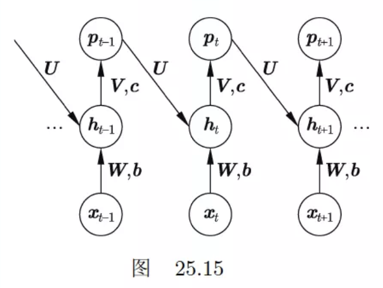
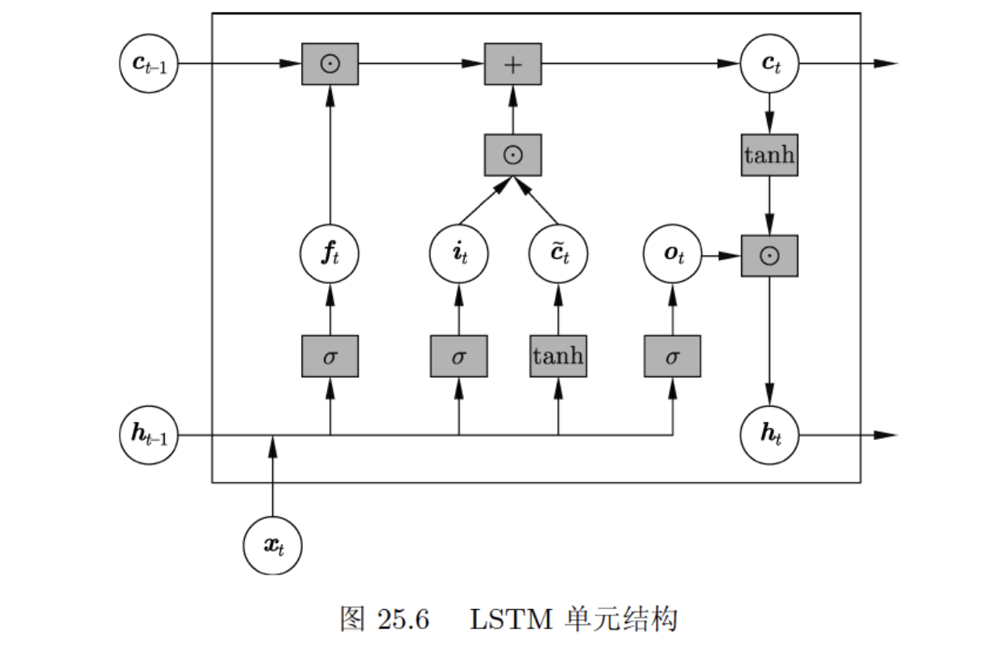

# 第25章循环神经网络

## 习题25.1

&emsp;&emsp;Jordan提出的循环神经网络如图25.15所示。试写出这种神经网络的公式，并与Elman提出的简单循环神经网络做比较。

**解答：**  

**解答思路：**

1. 给出简单循环神经网络（S-RNN）的定义
2. 给出Jordan提出的循环神经网络的公式
2. 比较Jordan RNN和S-RNN

**解答步骤：**  

**第1步：简单循环神经网络（S-RNN）的定义**

&emsp;&emsp;根据书中第25.1.1节的定义25.1的简单循环神经网络（即Elman提出的简单循环神经网络）的定义：

> **定义25.1（简单循环神经网络）** 称以下的神经网络为简单循环神经网络。神经网络以序列数据$x_1, x_2, \cdots, x_T$为输入，每一项是一个实数向量。在每一个位置上重复使用同一个神经网络结构。在第$t$个位置上（$t = 1, 2, \cdots, T$），神经网络的隐层或中间层以$x_t$和$h_{t-1}$为输入，以$h_t$为输出，其间有以下关系成立：
> $$
h_t = \tanh (U \cdot h_{t - 1} + W \cdot x_t + b) \tag{25.1}
$$
> 其中，$x_t$表示第$t$个位置上的输入，是一个实数向量$(x_{t,1}, x_{t,2}, \cdots, x_{t,n})^T$；$h_{t - 1}$表示第$t - 1$个位置的状态，也是一个实数向量$(h_{t-1,1}, h_{t-1,2}, \cdots, h_{t-1,m})^T$；$h_t$表示第$t$个位置的状态$(h_{t,1}, h_{t,2}, \cdots, h_{t,m})^T$，也是一个实数向量；$U,W$是权重矩阵；$b$是偏置向量。神经网络的输出层以$h_t$为输入，$p_t$为输出，有以下关系成立：
> $$
p_t = \text{softmax} (V \cdot h_t + c) \tag{25.2}
$$
> 其中，$p_t$表示第$t$个位置上的输出，是一个概率向量$(p_{t,1}, p_{t,2}, \cdots,p_{t,l})^T$，满足$\displaystyle p_{t,i} \geqslant 0 \ (i = 1, 2, \cdots, l), \sum_{i = 1}^l p_{t,i} = 1$；$V$是权重矩阵；$c$是偏置向量。神经网络输出序列数据$p_1, p_2, \cdots, p_T$，每一项是一个概率向量。  
> &emsp;&emsp;以上公式还可以写作
> $$
r_t = U \cdot h_{t - 1} + W \cdot x_t + b \tag{25.3}
$$
> 
> $$
h_t = \tanh(r_t) \tag{25.4}
$$
> 
> $$
z_t = V \cdot h_t + c \tag{25.5}
$$
> 
> $$
p_t = \text{softmax}(z_t) \tag{25.6}
$$
> 
> 其中，$r_t$是隐层的净输入向量，$z_t$是输出层的净输入向量。隐层的激活函数通常是双曲正切函数，也可以是其他激活函数；输出层的激活函数通常是软最大化函数。

**第2步：给出Jordan提出的循环神经网络的公式**

&emsp;&emsp;根据图25.15的循环神经网络架构，可得循环神经网络的公式如下：

$$
\boldsymbol{r}_t = \boldsymbol{U} \cdot \boldsymbol{p}_{t-1} + W \cdot \boldsymbol{x}_t + \boldsymbol{b} \\
\boldsymbol{h}_t = \tanh (\boldsymbol{r}_t) \\
\boldsymbol{z}_t = V \cdot \boldsymbol{h}_t + \boldsymbol{c} \\
\boldsymbol{p}_t = \text{softmax} (\boldsymbol{z}_{t})
$$

**第3步：比较Jordan RNN和S-RNN**

- 相同点：
    1. 两者都是描述动态系统的非线性模型
    2. 两者都满足循环神经网络的基本特点，包括可以处理任意长度的序列数据、属于自回归模型、具有强大的表示能力
    3. 两者都不能进行并行化处理

- 不同点：
    1. Jordan RNN采用softmax处理隐含层后的输出层作为下一层隐含层的输入，而 S-RNN 采用的是softmax处理前的隐含层作为下一层隐含层的输入
    2. 由于Jordan RNN采用的是经softmax处理后的隐含层，所以其分布较原本的隐含层改变了，尤其是类别间的差距被非线性放大或缩小（负值厌恶），这种对正负向的偏好在信息量表达上是不利的，这里直接建模相邻时间节点的隐含层可以建立更直接的相邻隐含层分布之间的关系，拥有更高的拓展性和普适性，所以后续的循环神经网络多以 S-RNN 作为基础机构。

## 习题25.2
&emsp;&emsp;写出循环神经网络的层归一化的公式。

**解答：**

**解答思路：**  

1. 给出层归一化的基本概念
2. 写出循环神经网络的层归一化的公式

**解答步骤：**  

**第1步：层归一化的基本概念**

&emsp;&emsp;根据书中第23.2.5节的层归一化的描述：

> &emsp;&emsp;层归一化（layer normalization）是另一种防止内部协变量偏移的方法。其基本想法与批量归一化相同，但是是在每一层的神经元上进行归一化，而不是在每一个批量的样本上进行归一化。优点是实现简单，也没有批量大小的超参数需要调节。  
> &emsp;&emsp;层归一化在每一层的神经元的净输入上进行。假设当前层的神经元的净输入是$z = (z_1, z_2, \cdots, z_m)^T$，其中$z_j$是第$j$个神经元的净输入，$m$是神经元个数。训练和预测时，首先计算这一层的神经元的净输入的均值与方差（无偏估计）。
> $$
\mu = \frac{1}{m} \sum_{j = 1}^m z_j \tag{23.65}
$$
> $$
\sigma^2 = \frac{1}{m - 1} \sum_{j = 1}^m (z_j - \mu)^2 \tag{23.66}
$$
> 
> 然后对每一个神经元的净输入进行归一化，得到数值：
> 
> $$
\bar{z}_j = \frac{z_j - \mu}{\sqrt{\sigma^2 + \epsilon}}, \ j= 1, 2, \cdots, m \tag{23.67}
$$
> 
> 其中，$\epsilon$是一个很小的正数。之后再进行仿射变换，得到数值：
> 
> $$
\tilde{z}_j = \gamma \cdot \bar{z}_j + \beta, \ j = 1, 2, \cdots, m \tag{23.68}
$$
> 
> 其中，$\gamma$和$\beta$是参数。最后将归一化加仿射变换的结果作为这一层神经元的实际净输入。在每一层都做相同的处理。神经网络的每一层都有两个参数$\gamma$和$\beta$。

**第2步：写出循环神经网络的层归一化的公式**

&emsp;&emsp;对于第$l$层循环神经网络层输入为$z^{(l)}$，其层归一化后的输出$\tilde{z}^{(l)}$为：
$$
\tilde{z}^{(l)} = \gamma \cdot \frac{z^{(l)}-\mu^{(l)}}{\sqrt{\sigma^{(l)}+\epsilon}} + \beta 
$$

记作$L N_{\gamma, \beta}\left(z^{(l)}\right)$，其中$\gamma$, $\beta$ 这里是缩放和平移的参数向量，和 $z^{(l)}$ 的维度相同；$\mu^{(l)}$为$\displaystyle \mu^{(l)}=\frac{1}{n^{(l)}} \sum_{i=1}^{n^{(l)}} z_i^{(l)}$；$\displaystyle \sigma^{(l)} = \frac{1}{n^{(l)} - 1} \sum_{i=1}^{n^{(l)}} (z_i^{(l)} - \mu^{(l)})^2$。

在循环神经网络中，假设在$t$时刻，隐层为$h_t$，其归一化的公式为

$$
z_t=U h_{t-1}+W x_t + b\\
h_t=f\left(L N_{\gamma, \beta}\left(z_t\right)\right)
$$

其中$x_t$ 表示第 $t$ 个位置上的输入，$U,W$ 为权重矩阵，$f(\cdot)$是激活函数。

## 习题25.3
&emsp;&emsp;比较前馈神经网络的反向传播算法与循环神经网络的反向传播算法的异同。

**解答：**

**解答思路：**  

1. 给出前馈神经网络的反向传播算法
2. 给出循环神经网络的反向传播算法
3. 比较两者的异同

**解答步骤：**   

**第1步：前馈神经网络的反向传播算法**

&emsp;&emsp;根据书中第23.2.3节的算法23.3的前馈神经网络的反向传播算法：

> **算法23.3 （前馈神经网络的反向传播算法）**    
输入：神经网络$f(\boldsymbol{x};\boldsymbol{\theta})$，参数向量$\boldsymbol{\theta}$，一个样本$(\boldsymbol{x}, \boldsymbol{y})$  
输出：更新的参数向量$\boldsymbol{\theta}$  
超参数：学习率$\eta$  
> 1.正向传播，得到各层输出$\boldsymbol{h}^{(1)}, \boldsymbol{h}^{(2)}, \cdots, \boldsymbol{h}^{(s)}$  
> $$
\boldsymbol{h}^{(0)} = \boldsymbol{x}
$$
> For $t = 1,2, \cdots, s$，do {
> $$
z^{(t)} = \boldsymbol{W}^{(t)} \boldsymbol{h}^{(t - 1)} + \boldsymbol{b}^{(t)} \\
\boldsymbol{h}^{(t)} = a (z^{(t)})
$$
> } 
> 
> $$
f(\boldsymbol{x}) = \boldsymbol{h}^{(s)}
$$
> 
> 2.反向传播，得到各层误差$\boldsymbol{\delta}^{(s)},\cdots, \boldsymbol{\delta}^{(2)}, \boldsymbol{\delta}^{(1)}$，同时计算各层的梯度，更新各层的参数。  
> 计算输出层的误差
> $$
\boldsymbol{\delta}^{(s)} = \boldsymbol{h}^{(s)} - \boldsymbol{y}
$$
> For $t = s, \cdots, 2, 1$，do {  
> &emsp;&emsp;计算第$t$层的梯度
> $$
\nabla_{\boldsymbol{W}^{(t)}} L = \boldsymbol{\delta}^{(t)} \cdot {\boldsymbol{h}^{(t - 1)}}^T \\
\nabla_{\boldsymbol{b}^{(t)}} L = \boldsymbol{\delta}^{(t)}
$$
>  &emsp;&emsp;根据梯度下降公式更新第$t$层的参数  
> $$
\boldsymbol{W}^{(t)} \leftarrow \boldsymbol{W}^{(t)} - \eta \nabla_{\boldsymbol{W}^{(t)}} L \\
\boldsymbol{b}^{(t)} \leftarrow \boldsymbol{b}^{(t)} - \eta \nabla_{\boldsymbol{b}^{(t)}} L
$$
>  &emsp;&emsp; If ($t > 1$) {  
>  &emsp;&emsp; &emsp;&emsp;将第$t$层的误差传到第$t - 1$层
> $$
\boldsymbol{\delta}^{(t - 1)} = \frac{\partial a}{\partial z^{(t - 1)}} \odot \left ( {\boldsymbol{W}^{(t)}}^T \cdot \boldsymbol{\delta}^{(t)} \right )
$$  
>  &emsp;&emsp;}  
> }
> 3.返回更新的参数向量

**第2步：循环神经网络的反向传播算法**

&emsp;&emsp;根据书中第25.1.2节的算法25.1的循环神经网络的反向传播算法：

> **算法25.1（随时间的反向传播算法）**    
> 输入：循环神经网络$f(x;\theta)$，参数$\theta$，样本$(x_1,x_2,...,x_T)$ 和 $(y_1,y_2,...,y_T)$。  
> 输出：更新的参数$\theta$  
> 超参数：学习率 $\eta$
> 1.正向传播，得到各个位置的输出  
> For $t = 1, 2, \cdots, T$，do {  
> &emsp;&emsp;将信号从前向后传播，计算隐层的输出$h_t$和输出层的输出$p_t$  
> $$
r_t = U \cdot h_{t - 1} + W \cdot x_t + b \\
h_t = \tanh (r_t) \\
z_t = V \cdot h_t + c \\
p_t = \text{softmax}(z_t)
$$
> }
> 2.反向传播，得到各个位置的梯度  
> For $t = T, \cdots, 2, 1$，do {  
> &emsp;&emsp;计算输出层的梯度$\displaystyle \frac{\partial{L}}{\partial{z_t}}$  
> $$
\frac{\partial{L}}{\partial{z_t}} = y_t - p_t
$$
> &emsp;&emsp;将梯度从后向前传播，计算隐层的梯度$\displaystyle \frac{\partial{L}}{\partial{r_t}}$  
> &emsp;&emsp;If ($t < T$) {  
> $$
\frac{\partial{L}}{\partial{r_t}} = \text{diag}(\boldsymbol{1} - \tanh^2 r_t) \cdot U^T \cdot \frac{\partial{L}}{\partial{r_{t+1}}} + \text{diag}(\boldsymbol{1} - \tanh^2 r_t) \cdot V^T \cdot \frac{\partial{L}}{\partial{z_t}}
$$
> &emsp;&emsp;} else {  
> $$
\frac{\partial{L}}{\partial{r_T}} = \text{diag}(\boldsymbol{1} - \tanh^2 r_T) \cdot V^T \cdot \frac{\partial{L}}{\partial{z_T}}
$$
> &emsp;&emsp;}  
> }  
> 3.进行参数更新  
> 计算梯度
> $$
\frac{\partial{L}}{\partial{c}} = \sum_{t = 1}^T \frac{\partial{L}}{\partial{z_t}} \\
\frac{\partial{L}}{\partial{V}} = \sum_{t = 1}^T \frac{\partial{L}}{\partial{z_t}} \cdot h_t^T \\
\frac{\partial{L}}{\partial{b}} = \sum_{t = 1}^T \frac{\partial{L}}{\partial{r_t}} \\
\frac{\partial{L}}{\partial{U}} = \sum_{t = 1}^T \frac{\partial{L}}{\partial{r_t}} \cdot h_{t - 1}^T \\
\frac{\partial{L}}{\partial{W}} = \sum_{t = 1}^T \frac{\partial{L}}{\partial{r_t}} \cdot x_t^T
$$
> 根据梯度下降公式更新参数
> $$
c \leftarrow c - \eta \frac{\partial{L}}{\partial{c}} \\
V \leftarrow V - \eta \frac{\partial{L}}{\partial{V}} \\
b \leftarrow b - \eta \frac{\partial{L}}{\partial{b}} \\
W \leftarrow W - \eta \frac{\partial{L}}{\partial{W}} \\
U \leftarrow U - \eta \frac{\partial{L}}{\partial{U}}
$$
> 4.返回更新的参数

**第3步：比较两者的异同**

- 相同点：
    1. 两者的反向传播学习的过程步骤相同，都是正向传播、反向传播、参数更新、返回更新的参数
    2. 两者在反向传播过程中都会因矩阵连乘，导致梯度消失和梯度爆炸

- 不同点：
    1. 在循环神经网络的反向传播中，矩阵的连乘接近矩阵的连续自乘，导致其梯度消失与爆炸的风险更严重；
    2. 循环神经网络的反向传播算法需要在时间上展开，计算量更大；
    3. 循环神经网络的反向传播算法中，每一个位置的参数共享，传播梯度为所有位置求和。而前馈网络神经网络的反向传播算法中没有参数共享；
    4. 循环神经网络的反向传播算法中，隐层的梯度来自输出层的梯度和下一个位置的隐层梯度两个方向。而前馈网络神经网络的反向传播算法中，隐层梯度只来自于输出层的梯度。

## 习题25.4
&emsp;&emsp;写出LSTM模型的反向传播算法公式。

**解答：**

**解答思路：**  

1. 给出LSTM的基本概念
2. 写出LSTM的反向传播算法公式推导
3. 写出LSTM的反向传播算法

**解答步骤：**   

**第1步：LSTM的基本概念**

&emsp;&emsp;根据书中第25.2.1节的定义25.2的长短期记忆网络（LSTM）：

> &emsp;&emsp;**定义25.2（长短期记忆网络）** 以下的循环神经网络称为长短期记忆网络。在循环网络的每一个位置上有状态和记忆元，以及输入门、遗忘门、输出门，构成一个单元。第$t$个位置上$(t = 1, 2, \cdots, T)$的单元是以当前位置的输入$x_t$、之前位置的记忆元$c_{t - 1}$、之前位置的状态$h_{t - 1}$为输入，以当前位置的状态$h_t$和当前位置的记忆元$c_t$为输出的函数，由以下方式计算。
> $$
i_t = \sigma(U_i \cdot h_{t - 1} + W_i \cdot x_t + b_i) \tag{25.20}
$$
> $$
f_t = \sigma(U_f \cdot h_{t - 1} + W_f \cdot x_t + b_f) \tag{25.21}
$$
> $$
o_t = \sigma(U_o \cdot h_{t - 1} + W_o \cdot x_t + b_o) \tag{25.22}
$$
> $$
\tilde{c}_t = \tanh (U_c \cdot h_{t - 1} + W_c \cdot x_t + b_c) \tag{25.23} 
$$
> $$
c_t = i_t \odot \tilde{c}_t + f_t \odot c_{t - 1} \tag{25.24}
$$
> $$
h_t = o_t \odot \tanh(c_t) \tag{25.25}
$$
> 这里$i_t$是输入门，$f_t$是遗忘门，$o_t$是输出门，$\tilde{c}_t$是中间结果。状态$h_t$、记忆元$c_t$、输入门$i_t$、遗忘门$f_t$、输出门$o_t$都是向量，其维度相同。

**第2步：写出LSTM的反向传播算法公式推导**

&emsp;&emsp;由上述LSTM算法公式，现为了区分$\tilde{c}_t$ 和 $c_t$，使用 $g_t$ 代替 $\tilde{c}_t$：

$$
i_t = \sigma\left(\tilde{i}_t\right) = \sigma(U_i \cdot h_{t - 1} + W_i \cdot x_t + b_i) \\
f_t = \sigma\left(\tilde{f}_t\right) = \sigma(U_f \cdot h_{t - 1} + W_f \cdot x_t + b_f) \\
o_t = \sigma\left(\tilde{o}_t\right) = \sigma(U_o \cdot h_{t - 1} + W_o \cdot x_t + b_o) \\
g_t = \tanh(\tilde{g}_t) = \tilde{c}_t = \tanh (U_c \cdot h_{t - 1} + W_c \cdot x_t + b_c) \\
c_t = i_t \odot g_t + f_t \odot c_{t - 1} \\
h_t = o_t \odot \tanh(c_t) \\
z_t = V \cdot h_t + c \\
p_t = \text{softmax}(z_t)
$$

这里$i_t$是输入门，$f_t$是遗忘门，$o_t$是输出门，$g_t$是中间结果。状态$h_t$、记忆元$c_t$、输入门$i_t$、遗忘门$f_t$、输出门$o_t$都是向量，其维度相同。

&emsp;&emsp;现考虑，已知$\displaystyle \frac{\partial L}{\partial z_t}, \frac{\partial L}{\partial c_{t+1}}, \frac{\partial L}{\partial \tilde{o}_{t+1}}, \frac{\partial L}{\partial \tilde{f}_{t+1}}, \frac{\partial L}{\partial \tilde{i}_{t+1}}, \frac{\partial L}{\partial \tilde{g}_{t+1}}$ 求某个隐层的梯度时，首先应该找到该隐层的输出层，然后分别计算输出层的梯度乘以输出层对该隐层的梯度，最后相加即可得到该隐层的梯度。

&emsp;&emsp;假设某一隐层的输出$h_t$，现计算$\displaystyle \frac{\partial L}{\partial h_t}$时，可找到该层神经元的后一层所有已连接的神经元的净输出 $ z_t, \tilde{o}_{t+1}, \tilde{f}_{t+1}, \tilde{i}_{t+1}, \tilde{g}_{t+1}$ ，然后分别计算该隐层的输出层的梯度（如$\displaystyle \frac{\partial L}{\partial z_t}$）与输出层的神经元对该隐层$h_t$的梯度的乘积（如 $\displaystyle \frac{\partial L}{\partial z_t} U^T_c $），最后相加即可得到该隐层的梯度:

$$
\frac{\partial L}{\partial h_{t}}
= \frac{\partial L}{\partial z_t} V^T + \frac{\partial L}{\partial \tilde{o}_{t+1}} U_o^T + \frac{\partial L}{\partial \tilde{f}_{t+1}} U_f^T + \frac{\partial L}{\partial \tilde{i}_{t+1}} U_i^T + \frac{\partial L}{\partial \tilde{g}_{t+1}} U_c^T 
$$

根据上述计算过程，可计算各个计算公式的中间输出结果的梯度：

$$
\begin{aligned}
\frac{\partial L}{\partial c_t}
&= \frac{\partial L}{\partial \tanh (c_t)} \frac{d \tanh(c_t)}{d c_t} + \frac{\partial L}{\partial c_{t+1}} \odot f_{t+1} \\
&= \left( \frac{\partial L}{\partial h_t} \odot o_t \right ) \cdot \text{diag}(\boldsymbol{1} - \tanh^2 c_t) + \frac{\partial L}{\partial c_{t + 1}} \odot f_{t + 1} 
\end{aligned}
$$

$$
\begin{aligned}
\frac{\partial L}{\partial \tilde{g}_t} 
&= \frac{\partial L}{\partial g_t} ( 1 - g_t^2 ) \\
&= (1 - g_t^2) \cdot \frac{\partial L}{\partial c_t} \odot i_t 
\end{aligned}
$$

$$
\begin{aligned}
\frac{\partial L}{\partial \tilde{i}_t}
&= \frac{\partial L}{\partial i_t} i_t ( 1 - i_t ) \\
&= i_t ( 1 - i_t ) \cdot \frac{\partial L}{\partial c_t} \odot g_t
\end{aligned}
$$

$$
\begin{aligned}
\frac{\partial L}{\partial \tilde{f}_t}
&= \frac{\partial L}{\partial f_t} f_t (1 - f_t) \\
&= f_t (1 - f_t) \cdot \frac{\partial L}{\partial c_t} \odot c_{t-1}
\end{aligned}
$$

$$
\begin{aligned}
\frac{\partial L}{\partial \tilde{o}_t}
&= \frac{\partial L}{\partial o_t} i_t (1 - o_t) \\
&= i_t (1 - o_t) \cdot \frac{\partial L}{\partial h_t} \odot \tanh (c_t)
\end{aligned}
$$

$$
\frac{\partial L}{\partial x_t} = \frac{\partial L}{\partial \tilde{o}_t} W_o^T + \frac{\partial L}{\partial \tilde{f}_t} W_f^T + \frac{\partial L}{\partial \tilde{i}_t} W_i^T + \frac{\partial L}{\partial \tilde{g}_t} W_c^T
$$

可求得各个参数的梯度，注意参数是在每个位置共享的，需要对所有位置求和。

$$
\frac{\partial L}{\partial U_o} = \sum_{t=1}^T \frac{\partial L}{\partial \tilde{o}_{t + 1}} \cdot h_t^T \\
\frac{\partial L}{\partial U_f} = \sum_{t=1}^T \frac{\partial L}{\partial \tilde{f}_{t + 1}} \cdot h_t^T \\
\frac{\partial L}{\partial U_i} = \sum_{t=1}^T \frac{\partial L}{\partial \tilde {i}_{t + 1}} \cdot h_t^T \\
\frac{\partial L}{\partial U_c} = \sum_{t=1}^T \frac{\partial L}{\partial \tilde{g}_{t + 1}} \cdot h_t^T 
$$

$$
\frac{\partial L}{\partial V} = \sum_{t=1}^T \frac{\partial L}{\partial z_t} \cdot h_t^T 
$$

$$
\frac{\partial L}{\partial W_o} = \sum_{t=1}^T \frac{\partial L}{\partial \tilde{o}_t} \cdot x_t^T \\
\frac{\partial L}{\partial W_f} = \sum_{t=1}^T \frac{\partial L}{\partial \tilde{f}_t} \cdot x_t^T \\
\frac{\partial L}{\partial W_i} = \sum_{t=1}^T \frac{\partial L}{\partial \tilde{i}_t} \cdot x_t^T \\
\frac{\partial L}{\partial W_c} = \sum_{t=1}^T \frac{\partial L}{\partial \tilde{g}_t} \cdot x_t^T 
$$

$$
\frac{\partial L}{\partial b_i} = \sum_{t=1}^T \frac{\partial L}{\partial \tilde{i}_t} \\
\frac{\partial L}{\partial b_f} = \sum_{t=1}^T \frac{\partial L}{\partial \tilde{f}_t} \\
\frac{\partial L}{\partial b_o} = \sum_{t=1}^T \frac{\partial L}{\partial \tilde{o}_t} \\
\frac{\partial L}{\partial b_c} = \sum_{t=1}^T \frac{\partial L}{\partial \tilde{g}_t} 
$$

**第3步：写出LSTM的反向传播算法**

输入：LSTM网络 $y=f(x;\theta)$，参数$\theta$，样本$(x_1, x_2, \cdots, x_T)$ 和 $(y_1, y_2, \cdots, y_T)$。  
输出：更新的参数$\theta$  
超参数：$\eta$

1. 正向传播，得到各个位置的输出

For $t = 1, 2, \cdots, T$ do {   
&emsp;&emsp;将信号从前向后传播，计算隐层的输出$h_t$ 和输出层的输出$p_t$ 
$$
i_t = \sigma\left(\tilde{i}_t\right) = \sigma(U_i \cdot h_{t - 1} + W_i \cdot x_t + b_i) \\
f_t = \sigma\left(\tilde{f}_t\right) = \sigma(U_f \cdot h_{t - 1} + W_f \cdot x_t + b_f) \\
o_t = \sigma\left(\tilde{o}_t\right) = \sigma(U_o \cdot h_{t - 1} + W_o \cdot x_t + b_o) \\
g_t = \tanh(\tilde{g}_t) = \tilde{c}_t = \tanh (U_c \cdot h_{t - 1} + W_c \cdot x_t + b_c) \\
c_t = i_t \odot g_t + f_t \odot c_{t - 1} \\
h_t = o_t \odot \tanh(c_t) \\
z_t = V \cdot h_t + c \\
p_t = \text{softmax}(z_t)
$$
}

2. 反向传播，得到各个位置的梯度

For $t =T, \cdots, 2, 1$ do {  
&emsp;&emsp;计算输出层的梯度$\displaystyle \frac{\partial{L}}{\partial{z_t}} $
$$
\frac{\partial{L}}{\partial{z_t}} = y_t - p_t
$$

&emsp;&emsp;将梯度从后向前传播，计算隐层的梯度$\displaystyle \frac{\partial L}{\partial \tilde{i}_t}, \frac{\partial L}{\partial \tilde{f}_t}, \frac{\partial L}{\partial \tilde{o}_t}$  
&emsp;&emsp;If $(t < T)$ {
$$
\frac{\partial L}{\partial \tilde{i}_t} = i_t ( 1 - i_t ) \cdot \frac{\partial L}{\partial c_t} \odot g_t \\
\frac{\partial L}{\partial \tilde{f}_t} = f_t (1 - f_t) \cdot \frac{\partial L}{\partial c_t} \odot c_{t-1} \\
\frac{\partial L}{\partial \tilde{o}_t} = i_t (1 - o_t) \cdot \frac{\partial L}{\partial h_t} \odot \tanh (c_t)
$$
&emsp;&emsp;&emsp;&emsp;其中
$$
\frac{\partial L}{\partial c_t} = \left( \frac{\partial L}{\partial h_t} \odot o_t \right ) \cdot \text{diag}(\boldsymbol{1} - \tanh^2 c_t) + \frac{\partial L}{\partial c_{t + 1}} \odot f_{t + 1} \\
\frac{\partial L}{\partial h_{t}}
= \frac{\partial L}{\partial z_t} V^T + \frac{\partial L}{\partial \tilde{o}_{t+1}} U_o^T + \frac{\partial L}{\partial \tilde{f}_{t+1}} U_f^T + \frac{\partial L}{\partial \tilde{i}_{t+1}} U_i^T + \frac{\partial L}{\partial \tilde{g}_{t+1}} U_c^T \\
g_t = \tanh (U_c \cdot h_{t - 1} + W_c \cdot x_t + b_c)
$$
&emsp;&emsp;} else { 

$$
\frac{\partial L}{\partial \tilde{i}_T} = i_T (1 - i_T) \cdot \frac{\partial L}{\partial c_T} \odot g_T \\
\frac{\partial L}{\partial \tilde{f}_T} = f_T (1 - f_T) \cdot \frac{\partial L}{\partial c_T} \odot c_{T-1} \\
\frac{\partial L}{\partial \tilde{o}_T} = i_T (1 - o_T) \cdot \frac{\partial L}{\partial h_T} \odot \tanh (c_T) 
$$
&emsp;&emsp;&emsp;&emsp;其中
$$
\frac{\partial L}{\partial c_T} = \left ( \frac{\partial L}{\partial h_T} \odot o_T \right) \cdot \text{diag} (\boldsymbol{1} - \tanh^2 c_T) \\
\frac{\partial L}{\partial h_T} = \frac{\partial L}{\partial z_T} V^T \\
g_T = \tanh (U_c \cdot h_{T - 1} + W_c \cdot x_T + b_c)
$$
&emsp;&emsp;}

3. 进行参数更新

计算梯度

$$
\frac{\partial L}{\partial U_o} = \sum_{t=1}^T \frac{\partial L}{\partial \tilde{o}_{t + 1}} \cdot h_t^T \\
\frac{\partial L}{\partial U_f} = \sum_{t=1}^T \frac{\partial L}{\partial \tilde{f}_{t + 1}} \cdot h_t^T \\
\frac{\partial L}{\partial U_i} = \sum_{t=1}^T \frac{\partial L}{\partial \tilde {i}_{t + 1}} \cdot h_t^T \\
\frac{\partial L}{\partial U_c} = \sum_{t=1}^T \frac{\partial L}{\partial \tilde{g}_{t + 1}} \cdot h_t^T 
$$

$$
\frac{\partial L}{\partial V} = \sum_{t=1}^T \frac{\partial L}{\partial z_t} \cdot h_t^T 
$$

$$
\frac{\partial L}{\partial W_o} = \sum_{t=1}^T \frac{\partial L}{\partial \tilde{o}_t} \cdot x_t^T \\
\frac{\partial L}{\partial W_f} = \sum_{t=1}^T \frac{\partial L}{\partial \tilde{f}_t} \cdot x_t^T \\
\frac{\partial L}{\partial W_i} = \sum_{t=1}^T \frac{\partial L}{\partial \tilde{i}_t} \cdot x_t^T \\
\frac{\partial L}{\partial W_c} = \sum_{t=1}^T \frac{\partial L}{\partial \tilde{g}_t} \cdot x_t^T 
$$

$$
\frac{\partial L}{\partial b_i} = \sum_{t=1}^T \frac{\partial L}{\partial \tilde{i}_t} \\
\frac{\partial L}{\partial b_f} = \sum_{t=1}^T \frac{\partial L}{\partial \tilde{f}_t} \\
\frac{\partial L}{\partial b_o} = \sum_{t=1}^T \frac{\partial L}{\partial \tilde{o}_t} \\
\frac{\partial L}{\partial b_c} = \sum_{t=1}^T \frac{\partial L}{\partial \tilde{g}_t} 
$$

根据梯度下降公式更新参数

$$
U_o \leftarrow U_o - \eta \frac{\partial L}{\partial U_o} \\
U_f \leftarrow U_f - \eta \frac{\partial L}{\partial U_f} \\
U_i \leftarrow U_i - \eta \frac{\partial L}{\partial U_i} \\
U_c \leftarrow U_c - \eta \frac{\partial L}{\partial U_c}
$$

$$
V \leftarrow V - \eta \frac{\partial L}{\partial V}
$$

$$
W_o \leftarrow W_o - \eta \frac{\partial L}{\partial W_o} \\
W_f \leftarrow W_f - \eta \frac{\partial L}{\partial W_f} \\
W_i \leftarrow W_i - \eta \frac{\partial L}{\partial W_i} \\
W_c \leftarrow W_c - \eta \frac{\partial L}{\partial W_c}
$$

$$
b_o \leftarrow b_o - \eta \frac{\partial L}{\partial b_o} \\
b_f \leftarrow b_f - \eta \frac{\partial L}{\partial b_f} \\
b_i \leftarrow b_i - \eta \frac{\partial L}{\partial b_i} \\
b_c \leftarrow b_c - \eta \frac{\partial L}{\partial b_c}
$$

4. 返回更新的参数

## 习题25.5
&emsp;&emsp;推导LSTM模型中记忆元的展开式(25.26)。

**解答：**

**解答思路：**  

1. 给出LSTM模型的记忆元表达式
2. 使用递归法推导记忆元的展开式

**解答步骤：**   

**第1步：LSTM模型的记忆元表达式**

&emsp;&emsp;根据书中第25.2.1节的LSTM的模型特点：

> &emsp;&emsp;当输入门和遗忘门满足$i_t = \boldsymbol{1}, f_t = 0$时，当前位置的记忆元$c_t$只依赖于当前位置的输入$x_t$和之前位置的状态$h_{t - 1}$，LSTM是S-RNN的近似。当输入门和遗忘门满足$i_t = 0, f_t = \boldsymbol{1}$时，当前位置的记忆元$c_t$只依赖于之前位置的记忆元$c_{t - 1}$，LSTM将之前位置的记忆元复制到当前位置。  
> &emsp;&emsp;当前位置的记忆元$c_t$可以展开成以下形式：
> $$
c_t = i_t \odot \tilde{c}_t + f_t \odot c_{t - 1} = \sum_{i = 1}^t \left( \prod_{j = i + 1}^t f_j \odot i_i \right) \odot \tilde{c}_i = \sum_{i = 1}^t w_i^t \odot \tilde{c}_i \tag{25.26}
$$
> 其中，$w_i^t$表示计算得到的第$t$个位置的权重。

**第2步：使用递归法推导记忆元的展开式**

&emsp;&emsp;根据递推形式，在第$t$个位置时，可得当前位置的记忆元$c_t$：
$$
c_t = i_t \odot \tilde{c}_t + f_t \odot c_{t - 1} \tag{1}
$$

&emsp;&emsp;在第$t-1$个位置时，可得之前位置的记忆元$c_{t - 1}$：
$$
c_{t-1} = i_{t-1}\odot\tilde{c}_{t-1} + f_{t-1} \odot c_{t-2} \tag{2}
$$

&emsp;&emsp;将式(2)带入式(1)中，可得：
$$
\begin{aligned}
c_t 
&= i_t \odot \tilde{c}_t + f_t \odot (i_{t-1} \odot \tilde{c}_{t-1} + f_{t-1}\odot c_{t-2}) \\
&= i_t \odot \tilde{c}_t + f_t \odot i_{t-1} \odot \tilde{c}_{t-1} + f_t \odot f_{t-1} \odot c_{t-2}
\end{aligned} \tag{3}
$$

&emsp;&emsp;逐步递归，可得：
$$
\begin{aligned}
c_t 
&= i_t \odot \tilde{c}_t + f_t \odot i_{t-1} \odot \tilde{c}_{t-1} + f_t \odot f_{t-1} \odot c_{t-2} \\
&= i_t \odot \tilde{c}_t + f_t \odot i_{t-1} \odot \tilde{c}_{t-1} + f_t \odot f_{t-1} \odot (i_{t-2} \odot \tilde{c}_{t-2} + f_{t-2} \odot c_{t-3}) \\
&= i_t \odot \tilde{c}_t + f_t \odot i_{t-1} \odot \tilde{c}_{t-1} + f_t \odot f_{t-1} \odot i_{t-2} \odot \tilde{c}_{t-2} + f_t \odot f_{t-1} \odot f_{t-2} \odot c_{t-3} \\
&= i_t \odot \tilde{c}_t + f_t \odot i_{t-1} \odot \tilde{c}_{t-1} + f_t \odot f_{t-1} \odot i_{t-2} \odot \tilde{c}_{t-2} + \cdots + f_t \odot f_{t-1} \odot f_3 \odot i_2 \odot \tilde{c}_2 + f_t \odot f_{t-1} \odot f_2 \odot c_1 \\
&= \sum_{i=2}^{t}(\prod_{j=i+1}^{t} f_j \odot i_i)\odot \tilde{c}_i + f_t \odot f_{t-1} \odot f_2 \odot c_1
\end{aligned}
$$

&emsp;&emsp;当在第1个位置时，$i_1 = \boldsymbol{1}$，则$c_1 = i_1 \odot \tilde{c}_1$

&emsp;&emsp;所以
$$
\begin{aligned}
c_t 
&= \sum_{i=2}^{t}(\prod_{j=i+1}^{t} f_j \odot i_i)\odot \tilde{c}_i + f_t \odot f_{t-1} \odot f_2 \odot c_1 \\
&= \sum_{i=2}^{t}(\prod_{j=i+1}^{t} f_j \odot i_i)\odot \tilde{c}_i + f_t \odot f_{t-1} \odot f_2 \odot i_1 \odot \tilde{c}_1 \\
&= \sum_{i=1}^{t}(\prod_{j=i+1}^{t} f_j \odot i_i)\odot \tilde{c}_i
\end{aligned}
$$

&emsp;&emsp;令第$t$个位置的权重可表示为
$$
w_i^t = \prod_{j=i+1}^{t} f_j \odot i_i
$$

则
$$
c_t = i_t \odot \tilde{c}_t + f_t \odot c_{t - 1} = \sum_{i = 1}^t \left( \prod_{j = i + 1}^t f_j \odot i_i \right) \odot \tilde{c}_i
 = \sum_{i = 1}^t w_i^t \odot \tilde{c}_i
$$

## 习题25.6

&emsp;&emsp;写出双向LSTM-CRF的模型公式。图25.16是双向LSTM-CRF的架构图。

**解答：**

**解答思路：**  

1. 给出双向循环神经网络的模型公式
2. 给出LSTM模型公式
3. 给出CRF模型公式
4. 根据双向LSTM-CRF架构图，写出模型公式

**解答步骤：**  

**第1步：双向循环神经网络的模型公式**

&emsp;&emsp;根据书中第25.2.4节的双向循环神经网络：

> &emsp;&emsp;前向的循环神经网络的隐层（状态）是：
> $$
h_t^{(1)} = \tanh (U^{(1)} \cdot h_{t - 1}^{(1)} + W^{(1)} \cdot x_t + b^{(1)}) \tag{25.35}
$$
> 后向的循环神经网络的隐层（状态）是：
> $$
h_t^{(2)} = \tanh (U^{(2)} \cdot h_{t - 1}^{(2)} + W^{(2)} \cdot x_t + b^{(2)}) \tag{25.36}
$$
> 两者的拼接是
$$
h_t = [h_t^{(1)}; h_t^{(2)}] \tag{25.37}
$$
> 其中，；表示两个向量的拼接。
$$
p_t = \text{softmax}(V \cdot h_t + c)
$$

**第2步：LSTM模型公式**

&emsp;&emsp;根据书中第25.2.1节的长短期记忆网络（LSTM）的模型公式：

> $$
i_t = \sigma(U_i \cdot h_{t - 1} + W_i \cdot x_t + b_i) \\
f_t = \sigma(U_f \cdot h_{t - 1} + W_f \cdot x_t + b_f) \\
o_t = \sigma(U_o \cdot h_{t - 1} + W_o \cdot x_t + b_o) \\
\tilde{c}_t = \tanh (U_c \cdot h_{t - 1} + W_c \cdot x_t + b_c) \\ 
c_t = i_t \odot \tilde{c}_t + f_t \odot c_{t - 1} \\
h_t = o_t \odot \tanh(c_t)
$$
> 这里$i_t$是输入门，$f_t$是遗忘门，$o_t$是输出门，$\tilde{c}_t$是中间结果。状态$h_t$、记忆元$c_t$、输入门$i_t$、遗忘门$f_t$、输出门$o_t$都是向量，其维度相同。

**第3步：CRF模型公式**

&emsp;&emsp;根据书中第11.2.3节的条件随机场（CRF）的简化形式：

> 条件随机场可以写成向量$w$与$F(y,x)$的内积的形式：
> $$
P_w(y|x) = \frac{\exp (w \cdot F(y, x))}{Z_w(x)} \tag{11.19}
$$
其中，
$$
Z_w(x) = \sum_y \exp (w \cdot F(y, x)) \tag{11.20}
$$

**第4步：根据双向LSTM-CRF架构图，写出模型公式**

&emsp;&emsp;双向LSTM-CRF的基本架构是在双向LSTM的输出层引入CRF，是序列标注的有代表性的方法。

&emsp;&emsp;前向的LSTM的隐层（状态）是
$$
h_t^f = \text{LSTM}_f (x_t, h_{t-1}^f)
$$
后向的LSTM的隐层（状态）是
$$
h_t^b = \text{LSTM}_b (x_t, h_{t+1}^b)
$$
其中，$\text{LSTM}_f$ 和 $\text{LSTM}_b$ 分别表示前向LSTM和后向LSTM，$h_{t-1}^f$ 和 $h_{t+1}^b$ 分别表示前向LSTM和后向LSTM的上一个位置的隐藏状态。

两者的拼接是
$$
h_t = [h_i^f; h_i^b]
$$
其中，；表示两个向量的拼接。

&emsp;&emsp;将 $h_t$ 输入到CRF层中，得到每个时间步的标签 $y_t$，并计算其对数概率 $p(y|x)$：

$$
p(y|x) = \frac{\exp(\text{score}(x, y))}{\displaystyle \sum_{y'} \exp(\text{score}(x, y'))}
$$

其中，$\text{score}(x, y)$ 表示序列 $x$ 对应标签序列 $y$ 的得分，可以使用线性模型进行计算：

$$
\text{score}(x, y) = \sum_{t=1}^n A_{y_t, y_{t-1}} + \sum_{t=1}^n B_{t, y_t}
$$

其中，$A$ 是状态转移矩阵，$B$ 是发射矩阵，$A_{y_t, y_{t-1}}$ 表示从状态 $y_{t-1}$ 转移到状态 $y_t$ 的得分，$B_{t, y_t}$ 表示在第$t$个位置，标签为 $y_t$ 的发射得分。
