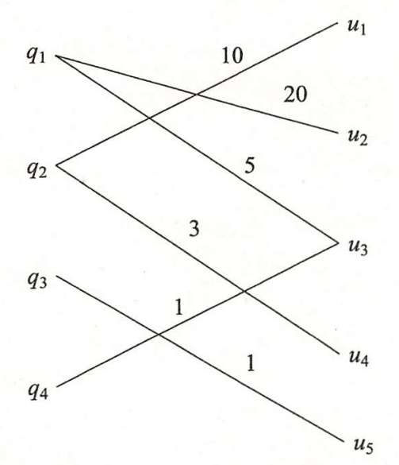

# 第15章 奇异值分解

## 习题15.1
&emsp;&emsp;试求矩阵
$$
A = \left[ 
\begin{array}{lll}
1 & 2 & 0 \\
2 & 0 & 2 \\
\end{array}
\right]
$$的奇异值分解。

**解答：**  

**解答思路：**

1. 给出奇异值分解的定义
2. 给出奇异值分解的步骤
3. 使用`numpy`实现奇异值分解
4. 自编程实现奇异值分解

**解答步骤：**  

**第1步：奇异值分解**

&emsp;&emsp;根据书中第271页奇异值分解的定义：
> **定义15.1（奇异值分解）** 矩阵的奇异值分解是指，将一个非零的$m \times n$实矩阵$A$，$A \in R^{m \times n}$，表示为以下三个实矩阵乘积形式的运算，即进行矩阵的因子分解：
> $$
A = U \Sigma V^T
$$
> 其中$U$是$m$阶正交矩阵，$V$是$n$阶正交矩阵，$\Sigma$是由降序排列的非负的对角线元素组成的$m \times n$矩形对角矩阵，
> $$
\begin{array}{l}
U U^T = I \\
V V^T = I \\
\Sigma = \text{diag}(\sigma_1, \sigma_2, \cdots, \sigma_p) \\
\sigma_1 \geqslant \sigma_2 \geqslant \cdots \sigma_p \geqslant 0 \\
p = \min(m, n)
\end{array}
$$
> $U \Sigma V^T$称为矩阵$A$的奇异值分解，$\sigma_i$称为矩阵$A$的奇异值，$U$的列向量称为左奇异向量，$V$的列向量称为右奇异向量。

**第2步：奇异值分解的一般步骤**

&emsp;&emsp;根据书中第282页奇异值分解的计算：
> 给定$m \times n$矩阵$A$，可以写出矩阵奇异值分解的计算过程。  
> （1）首先求$A^T A$的特征值和特征向量。  
> 计算对称矩阵$W=A^T A$。  
> 求解特征方程
> $$
(W - \lambda I)x = 0
$$
> 得到特征值$\lambda_i$，并将特征值由大到小排列
> $$
\lambda_1 \geqslant \lambda_2 \geqslant \cdots \geqslant \lambda_n \geqslant 0  
$$
> 将特征值$\lambda_i \ (i=1,2,\cdots,n)$代入特征方程求得对应的特征向量。  
> （2）求$n$阶正交矩阵$V$  
> 将特征向量单位化，得到单位特征向量$v_1, v_2, \cdot, v_n$，构成$n$阶正交矩阵$V$  
> $$
V = [v_1 \ v_2 \ \cdots \ v_n]
$$
> （3）求$m \times n$对角矩阵$\Sigma$  
> 计算$A$的奇异值
> $$
\sigma_i = \sqrt{\lambda_i}, \quad i=1,2,\cdots,n
$$
> 构造$m \times n$矩形对角矩阵$\Sigma$，主对角线元素是奇异值，其余元素是零
> $$
\Sigma = \text{diag} (\sigma_1, \sigma_2, \cdots, \sigma_n)
$$
> （4）求$m$阶正交矩阵$U$  
> 对$A$的前$r$个正奇异值，令  
> $$
u_j = \frac{1}{\sigma_j} A v_j, \quad j = 1, 2, \cdot, r
$$
> 得到
> $$
U_1 = [u1 \ u2 \ \cdots \ u_r]
$$
> 求$A^T$的零空间的一组标准正交基$\{u_{r+1}, u_{r+2}, \cdots, u_m \}$，令
> $$
U_2 = [u_{r+1} \ u_{r+2} \ \cdots \ u_m ] 
$$
> 并令
> $$
U = [U_1 \ U_2]
$$
> （5）得到奇异值分解
> $$
A = U \Sigma V^T
$$

**第3步：使用numpy实现奇异值分解**


```python
import numpy as np

A = np.array([[1, 2, 0],
              [2, 0, 2]])

# 调用numpy的svd方法
U, S, V = np.linalg.svd(A)

# 设置精度为2
np.set_printoptions(precision=2, suppress=True)

print("U=", U)
print("S=", S)
print("V=", V.T)
Sigma = np.zeros_like(A, float)
np.fill_diagonal(Sigma, S)
calc = np.dot(np.dot(U, Sigma), V)
print("A=", calc)
```

    U= [[ 0.45  0.89]
     [ 0.89 -0.45]]
    S= [3. 2.]
    V= [[ 0.75 -0.   -0.67]
     [ 0.3   0.89  0.33]
     [ 0.6  -0.45  0.67]]
    A= [[ 1.  2.  0.]
     [ 2. -0.  2.]]
    

**第4步：自编程实现奇异值分解**


```python
import numpy as np
from scipy.linalg import null_space


def my_svd(A):
    m = A.shape[0]

    # (1) 计算对称矩阵 A^T A 的特征值与特征向量，
    W = np.dot(A.T, A)
    # 返回的特征值lambda_value是升序的，特征向量V是单位化的特征向量
    lambda_value, V = np.linalg.eigh(W)
    # 并按特征值从大到小排列
    lambda_value = lambda_value[::-1]
    lambda_value = lambda_value[lambda_value > 0]
    # (2)计算n阶正价矩阵V
    V = V[:, -1::-1]

    # (3) 求 m * n 对角矩阵
    sigma = np.sqrt(lambda_value)
    S = np.diag(sigma) @ np.eye(*A.shape)

    # (4.1) 求A的前r个正奇异值
    r = np.linalg.matrix_rank(A)
    U1 = np.hstack([(np.dot(A, V[:, i]) / sigma[i])[:, np.newaxis] for i in range(r)])
    # (4.2) 求A^T的零空间的一组标准正交基
    U = U1
    if r < m:
        U2 = null_space(A.T)
        U2 = U2[:, r:]
        U = np.hstack([U, U2])

    return U, S, V
```


```python
A = np.array([[1, 2, 0],
              [2, 0, 2]])

np.set_printoptions(precision=2, suppress=True)

U, S, V = my_svd(A)
print("U=", U)
print("S=", S)
print("V=", V)
calc = np.dot(np.dot(U, S), V.T)
print("A=", calc)
```

    U= [[-0.45 -0.89]
     [-0.89  0.45]]
    S= [[3. 0. 0.]
     [0. 2. 0.]]
    V= [[-0.75 -0.   -0.67]
     [-0.3  -0.89  0.33]
     [-0.6   0.45  0.67]]
    A= [[ 1.  2. -0.]
     [ 2. -0.  2.]]
    

## 习题15.2
&emsp;&emsp;试求矩阵
$$
A = \left[ 
\begin{array}{lll}
2 & 4 \\
1 & 3 \\
0 & 0 \\
0 & 0 
\end{array}
\right]
$$的奇异值分解并写出其外积展开式。

**解答：**

**解答思路：**  

1. 给出矩阵的外积展开式定义
2. 使用`numpy`计算矩阵$A$的奇异值分解
3. 根据奇异值分解的结果，写出外积展开式 

**解答步骤：** 

**第1步：矩阵 $A$ 的外积展开式；**

&emsp;&emsp;根据书中第291页矩阵的外积展开式：
> &emsp;&emsp;矩阵$A$的奇异值分解$U \Sigma V^T$也可以由外积形式表示。事实上，若将$A$的奇异值分解看成矩阵$U \Sigma$和$V^T$的乘积，将$U \Sigma$按列向量分块，将$V^T$按行向量分块，即得
> $$
\begin{array}{l}
U \Sigma = \big[ \sigma_1 u_1 \ \sigma_2 u_2 \ \cdots \ \sigma_n u_n \big] \\
V^T = \left[ \begin{array}{c} 
v_1^T \\
v_2^T \\
\vdots \\
v_n^T 
\end{array} \right]
\end{array}
$$
> 则
> $$
A = \sigma_1 u_1 v_1^T + \sigma_2 u_2 v_2^T + \cdots + \sigma_n u_n v_n^T
$$
> 称为矩阵$A$的外积展开式，其中$u_k v_k^T$为$m \times n$矩阵，是列向量$u_k$和行向量$v_k^T$的外积，其第$i$行第$j$列元素为$u_k$的第$i$个元素与$v_k^T$的第$j$个元素的乘积。即
> $$
u_i v_j^T = \left[ 
\begin{array}{c} 
u_{1i} \\
u_{2i} \\
\vdots \\
u_{mi} 
\end{array} 
\right] \big[ v_{1j} \ v_{2j} \ \cdots \ v_{nj} \big] 
= \left[ \begin{array}{cccc} 
u_{1i} v_{1j} & u_{1i} v_{2j} & \cdots & u_{1i} v_{nj} \\
u_{2i} v_{1j} & u_{2i} v_{2j} & \cdots & u_{2i} v_{nj} \\
\vdots & \vdots & & \vdots \\
u_{mi} v_{1j} & u_{mi} v_{2j} & \cdots & u_{mi} v_{nj}
\end{array} \right]
$$
> $A$的外积展开式也可以写成下面的形式
> $$
A = \sum_{k=1}^n A_k = \sum_{k=1}^n \sigma_k u_k v_k^T
$$
> 其中$A_k = \sigma_k u_k v_k^T$是$m \times n$矩阵。上式将矩阵$A$分解为矩阵的有序加权和。

&emsp;&emsp;根据书中第294页本章概要中的外积展开式：
> 任意一个实矩阵$A$可以由其外积展开式表示
> $$
A = \sigma_1 u_1 v_1^T + \sigma_2 u_2 v_2^T + \cdots + \sigma_n u_n v_n^T
$$
> 其中$u_k v_k^T$为$m \times n$矩阵，是列向量$u_k$和行向量$v_k^T$的外积，$\sigma_k$为奇异值，$u_k, v_k^T, \sigma_k$通过矩阵$A$的奇异值分解得到。

**第2步：计算矩阵$A$的奇异值分解**


```python
import numpy as np

A = np.array([[2, 4],
              [1, 3],
              [0, 0],
              [0, 0]])

# 调用numpy的svd方法
U, S, V = np.linalg.svd(A)
np.set_printoptions()

print("U=", U)
print("S=", S)
print("V=", V.T)
```

    U= [[-0.82 -0.58  0.    0.  ]
     [-0.58  0.82  0.    0.  ]
     [ 0.    0.    1.    0.  ]
     [ 0.    0.    0.    1.  ]]
    S= [5.46 0.37]
    V= [[-0.4  -0.91]
     [-0.91  0.4 ]]
    

**第3步：根据奇异值分解的结果，写出外积展开式**

&emsp;&emsp;矩阵$A$的外积展开式为
$$
A = \sigma_1 u_1 v_1^T + \sigma_2 u_2 v_2^T
$$ 
其中
$$
\sigma_1 = 5.4649857, \sigma_2 = 0.36596619 \\ 
u_1 = \left [ \begin{array}{c}
-0.81741556 \\ 
-0.57604844 \\
0 \\
0
\end{array} \right],
u_2 = \left[ \begin{array}{c}
-0.57604844 \\
0.81741556 \\
0 \\
0
\end{array} \right ] \\
v_1^T = [ -0.40455358, -0.9145143 ] , v_2^T = [ -0.9145143,0.40455358 ]
$$ 


```python
calc = S[0] * np.outer(U[:, 0], V[:, 0]) + S[1] * np.outer(U[:, 1], V[:, 1])
print("A=", calc)
```

    A= [[ 2.  4.]
     [ 1.  3.]
     [-0.  0.]
     [-0.  0.]]
    

## 习题15.3
&emsp;&emsp;比较矩阵的奇异值分解与对称矩阵的对角化的异同。

**解答：**  

**解答思路：**  

1. 给出矩阵的奇异值分解的定义
2. 给出对称矩阵和方阵的对角化定义
3. 比较两者的相同点
4. 比较两者的不同点

**解答步骤：**   

**注意：** 与书中一致，不考虑复数矩阵。

**第1步：矩阵的奇异值分解的定义：**

&emsp;&emsp;矩阵的奇异值分解定义，详见书中第271页的定义15.1（奇异值分解）

**第2步：对称矩阵和方阵对角化定义；**

&emsp;&emsp;根据《实对称矩阵对角化教学的应用案例》（张丽静、刘白羽、申亚男，2019）第35页对称矩阵的对角化：
> 设$A$为$n$阶实对称矩阵，则存在一个正交矩阵$P = (p_1, p_2, \cdots, p_n)$，使得
> $$
A = P \Lambda P^T
$$
> 其中，$\Lambda$为对角元素是$A$的特征值$\lambda_1,\lambda_2,\cdots,\lambda_n$所构成的对角矩阵；$p_1,p_2,\cdots,p_n$为特征值$\lambda_1,\lambda_2,\cdots,\lambda_n$对应的单位特征向量。

&emsp;&emsp;根据参考资料：https://www.matongxue.com/parts/4628 中关于方阵的对角化：
> 如果$n$阶方阵$A$有$n$个线性无关的特征向量$p_1, p_2, \cdots,p_n$，那么如下矩阵：
> $$
P= (p_1, p_2, \cdots, p_n)
$$
> 可以使得：$ A = P \Lambda P^{-1}$，其中$\Lambda$为对角阵$\Lambda = \text{diag} \{ \lambda_1, \lambda_2, \cdots, \lambda_n \}$，特征值 $\lambda_1,\lambda_2,\cdots, \lambda_n$为特征向量$p_1, p_2, \cdots, p_n$对应的特征值，该过程为对角化（Diagonalizable）。

**第3步：两者的相同点**

1. 两者都可以实现特征分解，都需要求解特征值与特征向量
2. 实对称矩阵的对角化是方阵对角化的特例，矩阵奇异值分解又是方阵对角化的推广
3. 实对称矩阵一定可以对角化，矩阵的奇异值分解也一定存在
4. 都可以被正交矩阵对角化
5. 本质上都是用不同的基来描述线性变化

**第4步：两者的不同点**

1. 矩阵对角化要求矩阵$A$是一个方阵，矩阵奇异值分解不需要对矩阵$A$有特殊要求
2. 奇异值分解中要求对角元素降序排列，对称矩阵的对角化没有这一要求

## 习题15.4
&emsp;&emsp;证明任何一个秩为1的矩阵可以写成两个向量的外积形式，并给出实例。

**解答：**

**解答思路：**  
1. 假设矩阵$A$的秩为1，写出其奇异值分解形式
2. 将奇异值分解的矩阵$\Sigma$写成外积形式
3. 将矩阵$A$的奇异值分解写成外积形式
4. 给出实例

**解答步骤：**   

**第1步：假设矩阵 $A$ 的秩为1，写出其奇异值分解形式**

&emsp;&emsp;设矩阵$A_{m\times n}$的秩为1。

&emsp;&emsp;根据书中第273页奇异值分解基本定理：
> **定理15.1（奇异值分解基本定理）** 若$A$为一$m \times n$实矩阵，$A \in R^{m \times n}$，则$A$的奇异值分解存在
> $$
A = U \Sigma V^T
$$
> 其中$U$是$m$阶正交矩阵，$V$是$n$阶正交矩阵，$\Sigma$是$m \times n$矩形对角矩阵，其对角线元素非负，且按降序排列。

&emsp;&emsp;则存在矩阵$A$的奇异值分解
$$
A= U \Sigma V^T \tag{1}
$$

**第2步：将奇异值分解的矩阵$\Sigma$写成外积形式；** 

&emsp;&emsp;根据矩阵$A$的秩与对角矩阵$\Sigma$的秩之间的关系：
$$
\text{rank}(\Sigma) = \text{rank}(A) = 1
$$

&emsp;&emsp;根据奇异值分解基本定理，对角矩阵$\Sigma$的奇异值是降序排列的，所以其中的非零元素一定位于第一行第一列，可设为 
$$
\left[ \begin{array}{cc}
\sigma_1 & \\ 
& O_{(m-1) \times (n-1)} 
\end{array} \right]_{m \times n}
$$

&emsp;&emsp;设两向量 $a = [1,0,\cdots,0]_{m\times 1}^T, b = [\sigma_1, 0, \cdots, 0]_{n\times 1}^T$，可得：
$$
\Sigma = a b^T \tag{2}
$$  

**第3步：将矩阵$A$ 的奇异值分解写成外积形式** 

&emsp;&emsp;将式（2）代入式（1）中可得：
$$
A = U a b^T V^T = (Ua)(Vb)^T 
$$ 
其中，$Ua$是$m\times 1$阶的列向量，$Vb$是$n\times 1$阶的列向量。

&emsp;&emsp;所以，矩阵$A$可以写成向量$Ua$和向量$Vb$的外积形式，命题得证。

**第4步：给出实例** 

&emsp;&emsp;使用书中第283页例15.5的矩阵$A = \left[ \begin{array}{ccc} 1 & 1 \\ 2 & 2 \\ 0 & 0 \end{array} \right]$的秩为1，矩阵$A$的奇异值分解为
$$
\begin{aligned}
A 
&= U\Sigma V^T \\
&= \left[ \begin{array}{ccc}\frac{1}{\sqrt{5}}&-\frac{2}{\sqrt{5}}&0\\\frac{2}{\sqrt{5}}&\frac{1}{\sqrt{5}}&0\\0&0&1\end{array} \right]\left[ \begin{array}{ccc}\sqrt{10}&0\\0&0\\0&0\end{array} \right]\left[ \begin{array}{cc}\frac{1}{\sqrt{2}}&\frac{1}{\sqrt{2}}\\\frac{1}{\sqrt{2}}&-\frac{1}{\sqrt{2}}\end{array} \right]
\end{aligned}
$$

&emsp;&emsp;可知：
$$
\begin{array}{l}
\Sigma = \left[ \begin{array}{ccc}
\sqrt{10} & 0 \\
0 & 0 \\
0 & 0
\end{array} \right] 
= \left[ \begin{array}{c}
1 \\ 0 \\ 0 
\end{array} \right]
[ \sqrt{10}, \ 0] =ab^T \\
Ua = \left[ \begin{array}{c}
\frac{1}{\sqrt{5}}\\
\frac{2}{\sqrt{5}}\\ 
0 
\end{array} \right], Vb = \left[ \begin{array}{c}
\sqrt{5} \\
\sqrt{5}
\end{array} \right]
\end{array}
$$

&emsp;&emsp;所以，$(Ua)(Vb)^T = \left[ 
\begin{array}{ccc}
1 & 1 \\
2 & 2 \\
0 & 0
\end{array} \right] =A$ 

## 习题15.5
&emsp;&emsp;搜索中的点击数据记录用户搜索时提交的查询语句，点击的网页URL以及点击的次数构成一个二部图，其中一个结点集合$\{q_i\}$表示查询，另一个结点集合$\{u_j\}$表示URL，边表示点击关系，边上的权重表示点击次数。图15.2是一个简化的点击数据例。点击数据可以由矩阵表示，试对该矩阵进行奇异值分解，并解释得到的三个矩阵所表示的内容。

<center>

<br/><div style="color:orange; border-bottom: 1px solid #d9d9d9;display: inline-block;color: #000;padding: 2px;">图15.2 搜索点击数据例</div></center>

**解答：**

**解答思路：**  

1. 根据二部图写出矩阵$A$
2. 计算矩阵$A$的奇异值分解
3. 解释奇异值分解得到的矩阵$U、\Sigma、V$代表的内容

**解答步骤：**   

**第1步：根据二部图写出矩阵$A$**

$$
A=\left[ \begin{array}{cccc}
0 & 20 & 5 & 0 & 0 \\
10 & 0 & 0 & 3 & 0 \\
0 & 0 & 0 & 0 & 1 \\
0 & 0 & 1 & 0 & 0 
\end{array} \right]
$$
其中，行向量分别对应$(q_1, q_2, q_3, q_4)$，列向量分别对应$(u_1, u_2, u_3, u_4, u_5)$ 。

**第2步：对矩阵 $A$ 进行奇异值分解;**


```python
import numpy as np

A = np.array([[0, 20, 5, 0, 0],
              [10, 0, 0, 3, 0],
              [0, 0, 0, 0, 1],
              [0, 0, 1, 0, 0]]) 

# 调用numpy的svd方法
U, S, V = np.linalg.svd(A)

print("U=", U)
print("S=", S)
print("V=", V.T)
```

    U= [[ 1.   -0.    0.   -0.01]
     [ 0.    1.    0.   -0.  ]
     [ 0.    0.    1.    0.  ]
     [ 0.01  0.    0.    1.  ]]
    S= [20.62 10.44  1.    0.97]
    V= [[ 0.    0.96 -0.   -0.    0.29]
     [ 0.97 -0.   -0.   -0.24 -0.  ]
     [ 0.24  0.    0.    0.97  0.  ]
     [ 0.    0.29  0.    0.   -0.96]
     [ 0.    0.    1.    0.    0.  ]]
    

**第3步：解释奇异值分解得到的矩阵$U$、$\Sigma$、$V$代表的内容**

&emsp;&emsp;根据题意，可知搜索中的点击数据记录用户搜索时提交的查询语句为$\{q_i\}$，点击的网页URL为$\{u_j\}$，点击的次数为矩阵的值。根据奇异值分解定理，可知：
- $U$表示用户输入的查询语句与网页特征之间的关系矩阵
- $V$表示网页与网页特征之间的相似性
- $\Sigma$表示用户输入的查询语句映射到网页的权重

&emsp;&emsp;举个例子：从矩阵$U$的第一列可以表示查询语句$q_1$与网页特征1的关系密切，通过矩阵$V$可以表示网页$u_2$与特征1的相似度最高，所以查询 $q_1$的时候点击网页$u_2$的次数是最多的。

&emsp;&emsp;奇异值分解的另一个作用就是提取网页的特征来将用户输入与网页映射到一个低纬度空间中。通过第2步的计算，可以发现$\sigma_1,\sigma_2$的值比较大，计算截断的矩阵外积展开$A' = \sigma_1u_1v_1^T+\sigma_2u_2v_2^T$，可以发现其与矩阵$A$大体上是相等的。奇异值下降的速度越快，那么矩阵包含的更多信息就越集中分布在前面几个值比较大的特征上面。
